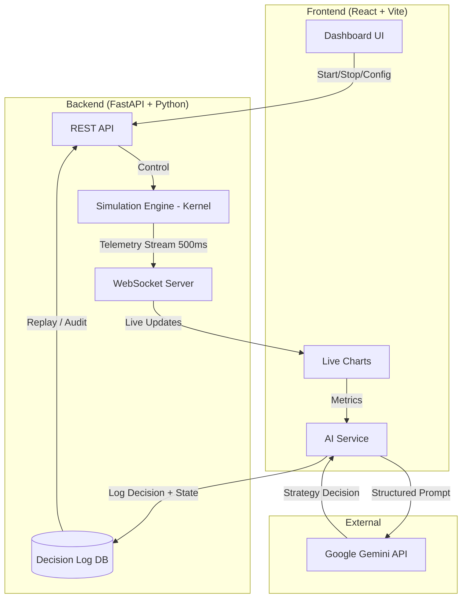

# 🧠 SchedulerAI — Autonomous Distributed System Orchestrator

> *"Static logic cannot survive dynamic chaos."*


SchedulerAI is a **self-driving infrastructure simulator** that uses Generative AI (Google Gemini) to dynamically detect deadlocks, resolve contention, and hot-swap scheduling strategies in real time — with fully reproducible, DB-backed decision logging.

Think of it as **Kubernetes + OS scheduling algorithms + an autonomous SRE agent**, all inside one interactive system.

---

## 📌 Table of Contents

- [The Problem](#-the-problem-thundering-herds)
- [The Solution](#-the-solution-self-driving-infrastructure)
- [Architecture](#-system-architecture)
- [Key Features](#-key-features)
- [Dashboard](#-dashboard)
- [OS Concepts](#-operating-system-concepts-implemented)
- [Tech Stack](#-tech-stack)
- [Installation](#-installation--setup)
- [How to Run](#-how-to-run)

---

## 💥 The Problem: Thundering Herds

Modern distributed systems (Netflix, AWS, Databases, Edge Networks) frequently collapse not from hardware failures but from:

- Resource Contention
- Live-locks / Deadlocks
- Hot Spots
- Queue Overload
- Race Conditions

Static scheduling algorithms fail exactly when traffic becomes unpredictable.

| Algorithm | Failure Mode |
|---|---|
| Round Robin | Creates hot spots — one server overloaded while others idle |
| Token Ring | Fair but extremely slow under high load |
| Random Backoff | Reduces collisions but drastically increases latency |
| Consistent Hashing | Good for sharding but terrible for bursty traffic |

> ⚠️ By the time humans detect a bottleneck, the system has already collapsed.

---

## 💡 The Solution: Self-Driving Infrastructure

SchedulerAI uses a continuous **OODA Loop** driven by an LLM:

**🔍 Observe**
A discrete-event simulation engine ("Kernel") emits live telemetry every 500ms.

**🧭 Orient**
A React dashboard visualizes server load, queue depth, throughput, and contention in real time.

**🤖 Decide**
A Gemini-powered agent analyzes patterns to detect deadlocks, starvation, excessive queueing, and load imbalance.

**⚡ Act**
Based on semantic reasoning, the AI switches the scheduling algorithm on the fly.
No restarts. No downtime. Fully autonomous.

---

## 🏗 System Architecture



**Design Philosophy:** OS Kernel + Distributed System Simulator + AI SRE — loosely coupled via REST + WebSockets, with a reproducible decision audit trail.

---

## 🚀 Key Features

### 🧩 1. Multi-Strategy Kernel

Simulates 5 real OS & distributed scheduling algorithms:

| Strategy | Based On |
|---|---|
| FCFS | Classic OS baseline — fast but unfair |
| Random Backoff | CSMA/CD — Ethernet-style collision handling |
| Consistent Hashing | Used in Cassandra, DynamoDB |
| Token Ring | Ensures strict mutual exclusion |
| Leader Election | Kubernetes-style orchestrator simulation |

### 🤖 2. Autonomous AI SRE (Rebuilt — Genuine LLM Reasoning)

Google Gemini 2.5 is integrated as a real-time reasoning engine with **structured outputs and forced reasoning** — not rule-based fallbacks.

- Consumes live JSON metrics from the simulation kernel
- Uses structured output prompts that force genuine strategy justification
- Issues valid, validated control commands per time step
- Detects deadlocks before they cascade

### 🔍 3. Reproducible Decision Logging

Every AI strategy decision is logged to a database with full context:

- Complete system state snapshot at decision time
- Full Gemini prompt and raw response
- Isolated RNG seed for exact run replay
- Config versioning for fair A/B strategy comparison

> This means every benchmark result is traceable, replayable, and defensible — not derived from hardcoded fallbacks.

### 📊 4. Real-Time Dashboard

Built with Recharts + WebSockets, delivering live updates.

| Panel | What It Shows |
|---|---|
| Run ID & Time Steps | Current simulation session identifier |
| Job Queue | Incoming jobs waiting for assignment |
| Jobs Done | Completed job throughput over time |
| Server Nodes | Per-node processing state and load |
| Comparison Panel | Side-by-side strategy performance metrics |
| Agent Decision Sidebar | Live LLM reasoning log per decision |

### 🔐 5. Deadlock Detection Engine

Built-in heuristics monitor:
- Queue stagnation across time steps
- Circular wait patterns
- Token starvation
- Low throughput-to-arrival ratio

When detected → AI picks a recovery strategy autonomously.

---

## 🎓 Operating System Concepts Implemented

| OS Concept | Implemented As |
|---|---|
| Process Scheduling | Job Queue + 5 Kernel strategies |
| Concurrency | Python asyncio throughout |
| Deadlock Detection | Queue vs Throughput heuristics |
| Race Conditions | Random Backoff collision simulation |
| Mutual Exclusion | Token Ring implementation |
| IPC | WebSockets between backend ↔ frontend |
| Audit Trail | DB-backed decision log with seed replay |

> This project is essentially a teaching OS kernel, visualized in real time.

---

## 🛠 Tech Stack

| Layer | Tech |
|---|---|
| Frontend | React 19, TypeScript, Tailwind CSS, Recharts, Vite |
| Backend | FastAPI, Python 3.11, AsyncIO, SQLModel, Uvicorn |
| AI | Google Gemini 2.5 API (Structured Outputs) |
| Database | SQLite via SQLModel (decision log) |
| DevOps | Docker, Git |

---

## ⚙️ Installation & Setup

**Prerequisites**
- Node.js 18+
- Python 3.10+
- Gemini API Key

**1️⃣ Backend Setup**

```bash
cd backend
python -m venv venv

# Windows
.\venv\Scripts\activate
# Mac/Linux
source venv/bin/activate

pip install -r requirements.txt
uvicorn app.main:app --reload --port 8000
```

**2️⃣ Frontend Setup**

```bash
npm install
```

Create `.env.local`:
```
GEMINI_API_KEY=your_key_here
```

```bash
npm run dev
```

---

## 🎮 How to Run

1. Start backend on port `8000`
2. Start frontend on port `3000`
3. Open `http://localhost:3000`
4. Click **"Start Simulation → Baseline"**

Watch:
- 📈 Queue length rise and fall across time steps
- ⚙️ Server nodes handling and completing jobs
- 🤖 AI agent reasoning log updating in the sidebar
- 🔁 Algorithm hot-swaps triggered by deadlock detection
- 📋 Every decision logged with full state for replay

---

## 👩‍💻 Author

**Ashmeen Khaira**
SDE Intern Aspirant | Java • Backend • ML Research | B.E. @ Thapar '27

[](https://linkedin.com/in/ashmeen)
[](https://github.com/ashmeenkhaira)
