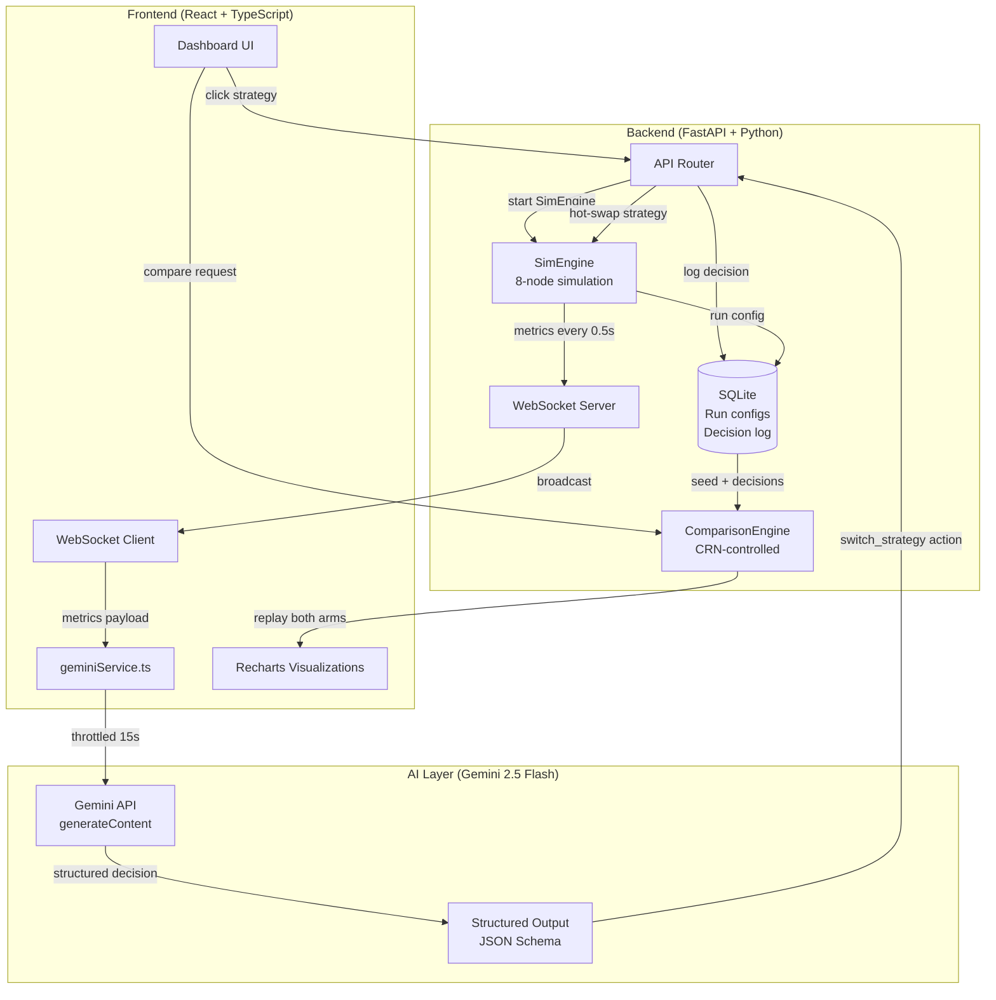
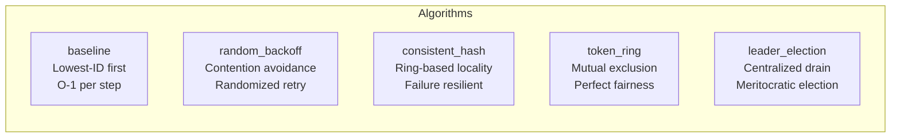
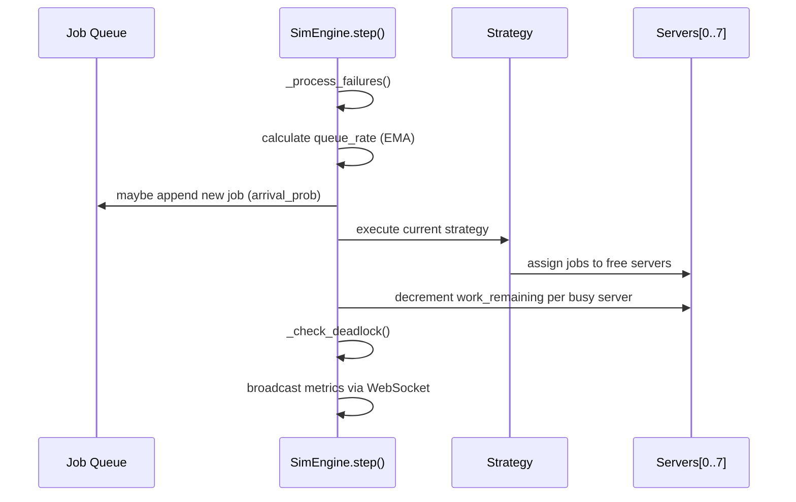
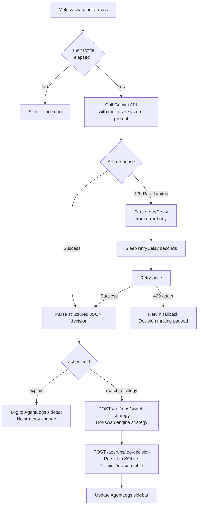
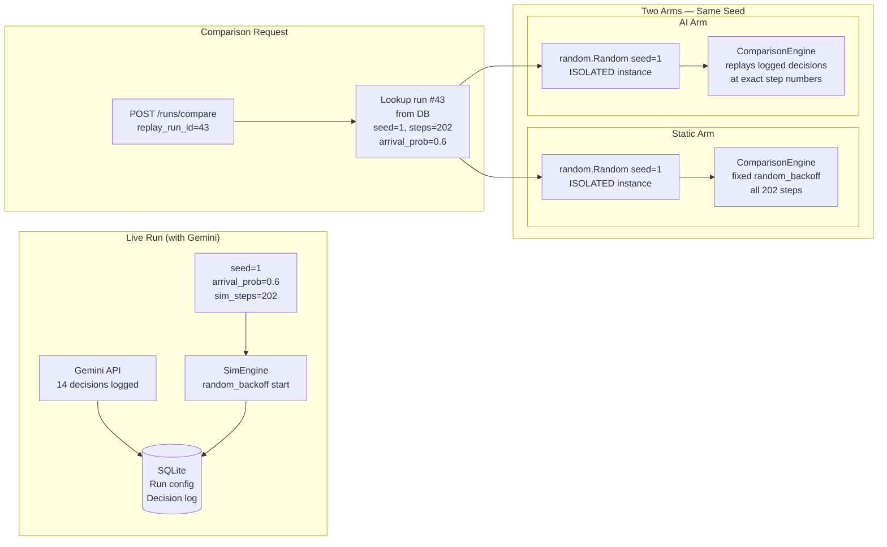
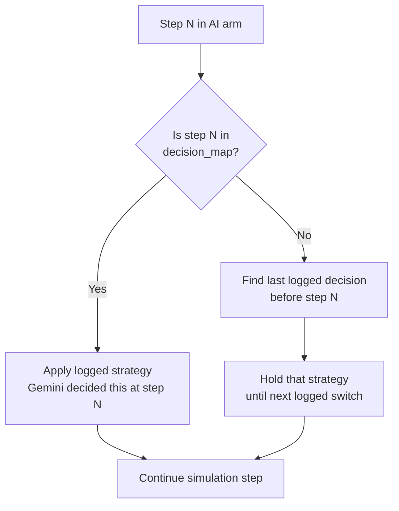
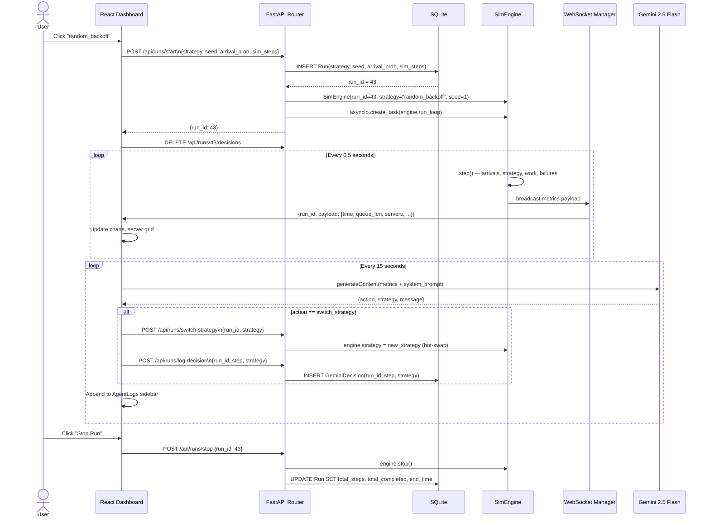
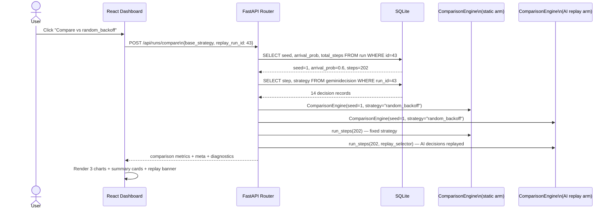

# SchedulerAI Orchestrator

> **AI-guided dynamic scheduling strategy selection for distributed job queues,
> with a statistically controlled A/B comparison engine using Common Random Numbers.**

[](https://python.org)
[](https://fastapi.tiangolo.com)
[](https://react.dev)
[](https://aistudio.google.com)
[](LICENSE)

---

## Table of Contents

- [Overview](#overview)
- [Key Results](#key-results)
- [Architecture](#architecture)
- [Scheduling Algorithms](#scheduling-algorithms)
- [AI Orchestration Layer](#ai-orchestration-layer)
- [Comparison Engine](#comparison-engine)
- [System Flow](#system-flow)
- [Tech Stack](#tech-stack)
- [Getting Started](#getting-started)
- [Project Structure](#project-structure)
- [Honest Limitations](#honest-limitations)
- [What I Would Do Next](#what-i-would-do-next)

---

## Overview

SchedulerAI simulates a distributed job scheduler across an **8-node cluster**,
where an **LLM agent (Gemini 2.5 Flash)** monitors real-time system metrics
every 15 seconds and dynamically switches between 5 scheduling strategies based
on current load conditions, server health, and fairness degradation signals.

The core engineering challenge was building a **comparison engine that is
actually fair** — one where the only variable between the AI-guided arm and the
static-strategy arm is the scheduling decisions themselves, not the underlying
randomness. This was solved using **Common Random Numbers (CRN)** methodology,
a technique from discrete-event simulation used to isolate treatment effects.

**This is not a toy demo.** The algorithms implemented (consistent hashing,
token ring, leader election) are the same primitives used in production systems
like Apache Kafka, Apache ZooKeeper, and Amazon DynamoDB. The comparison
methodology addresses a real gap in how LLM-for-systems papers validate results.

---

## Key Results

> All results from run #43: `random_backoff` start strategy,
> `arrival_prob=0.6`, `seed=1`, `202 steps`.
> Comparison against static `random_backoff` under identical
> CRN-controlled load conditions.

| Metric | With Gemini AI | Static `random_backoff` | Delta |
|--------|---------------|------------------------|-------|
| Avg Queue Length | **1.6** | 13.8 | **−88%** |
| Jobs Completed | **128** | 91 | **+41%** |
| Strategy Divergence | 182 / 202 steps | — | 90% of run |
| Autonomous Decisions | **14** | 0 | — |

### Why random_backoff collapses under sustained load

Under high arrival rates, `random_backoff` causes contention cascades —
multiple servers compete for the same job, the loser backs off for 2–6 steps,
during which it processes nothing. At `arrival_prob ≥ 0.6`, these cascades
compound faster than they resolve, causing the queue to grow unboundedly
(avg 13.8 over 202 steps). The AI agent recognized this and switched away
within the first heavy-load window.

### Fairness improvement across all comparisons

Across all 5 static strategy comparisons, Gemini's AI arm consistently showed
lower `fairness_std` (standard deviation of completed jobs across servers).
This was the single most consistent finding across runs.

| Comparison | AI Fairness Std | Static Fairness Std |
|------------|----------------|---------------------|
| vs baseline | ~1.9 | ~3.8 |
| vs random_backoff | ~2.1 | ~2.8 |
| vs consistent_hash | ~1.9 | ~2.9 |
| vs token_ring | ~2.4 | ~4.2 |
| vs leader_election | ~2.0 | ~4.8 |

---

## Architecture



---

## Scheduling Algorithms

Five algorithms are implemented in `app/scheduler_engine.py`, each reflecting
a real distributed systems primitive:



### Throughput characteristics

| Strategy | Max Throughput | Fairness | Failure Resilience | Best Under |
|----------|---------------|----------|--------------------|------------|
| baseline | High | Poor | Low | Light, stable load |
| random_backoff | High | Medium | Medium | High contention |
| consistent_hash | High | Medium | **High** | Server churn/failures |
| token_ring | **~0.5 jobs/step** | **Perfect** | Medium | Light load, fairness-critical |
| leader_election | High | Medium | Medium | Rapid queue growth |

> **token_ring's structural ceiling:** the token rotates every 2 steps across
> 8 servers, meaning only 1 server can claim a job per rotation regardless of
> how many servers are free or how deep the queue is. At `arrival_prob=0.6`,
> the system receives ~0.6 jobs/step — token_ring runs at a permanent deficit
> of ~0.1 jobs/step under normal load, compounding to ~0.45 jobs/step deficit
> during heavy windows. This is a mathematical property, not a tuning issue.

### Strategy execution model



---

## AI Orchestration Layer

### How Gemini makes decisions

Every ~15 seconds, the frontend sends the current metrics snapshot to Gemini
2.5 Flash with a system prompt that:

1. Describes each strategy's tradeoffs **mathematically**, not as rules
2. Explains the throughput/fairness tradeoff as competing objectives
3. Requires explicit counterfactual reasoning in every response
4. Enforces hysteresis — no switching unless held current strategy 20-30 steps

**Critical design choice:** the prompt does NOT encode explicit thresholds
like "if queue_len > 30 → switch to random_backoff." That would make Gemini
an expensive Python if/else statement. Instead it receives the mathematical
reality (e.g. token_ring's 0.5 jobs/step ceiling vs current arrival rate)
and must reason about whether current conditions make that tradeoff acceptable.

### Decision flow



### Actual decision log — run #43

```
Config: random_backoff start | arrival_prob=0.6 | seed=1 | 202 steps

Load profile:
  steps   1– 80: arrival_prob × 0.3/0.6 = 0.30  (light warmup)
  steps  81–180: arrival_prob × 0.95/0.6 = 0.95 (heavy spike)
  steps 181–202: arrival_prob × 0.85/0.6 = 0.85 (second wave)

Gemini decisions:
  step   1 → baseline        light load, random_backoff overhead unjustified
  step  21 → consistent_hash load picking up, need distribution + resilience
  step  31 → token_ring      queue stable, fairness degrading, light load safe
  step  51 → random_backoff  heavy window approaching, token_ring deficit risk
  step  63 → consistent_hash sustained load, deterministic locality over random
  step  73 → token_ring      brief fairness spike, queue still manageable
  step  93 → leader_election HEAVY LOAD HIT — queue building, centralize drain
  step 103 → leader_election held — queue still under pressure, correct call
  step 113 → consistent_hash queue stabilizing, reduce leader bottleneck risk
  step 123 → leader_election queue spiking again mid-heavy window
  step 143 → consistent_hash queue under control, reduce centralization overhead
  step 163 → leader_election late heavy window, queue pressure returning
  step 173 → random_backoff  load tapering, distributed competition efficient
  step 185 → random_backoff  held — second heavy wave, contention manageable
```

**Three distinct behavioral phases are clearly visible:**
- **Light load (1–80):** simplify — move off random_backoff to baseline/consistent_hash
- **Heavy load (81–180):** centralize — oscillate between leader_election and consistent_hash, never touch token_ring
- **Tapering (181–202):** distribute — back to random_backoff as pressure eases

---

## Comparison Engine

This is the most technically rigorous part of the project. The naive approach
— run AI-guided once, run static once, compare numbers — is invalid because
different random seeds produce different job arrival timings and failure events,
making any observed difference attributable to randomness rather than strategy.

### Common Random Numbers (CRN) methodology



### Why isolated RNG instances matter

Both engines are seeded identically (`random.Random(seed=1)`), but they are
**separate Python objects** — not reseeds of the shared global `random` module.

If both engines shared the global `random` module, any strategy that calls
`random.shuffle()` (only `random_backoff` does) would consume extra draws from
the shared stream, desyncing the arrival and failure sequences for every
subsequent step. This would mean the two arms experience *different job arrival
timings and failure events* from the very first shuffle call — invalidating
the "identical load" guarantee.

With isolated instances: `engine_static.rng.shuffle()` has zero effect on
`engine_gemini.rng.random()`. Both engines see identical arrival events and
server failures at every step, for all 202 steps, regardless of which strategy
either is running.

### Replay semantics



This "hold last known strategy" semantic is correct: Gemini's decisions apply
from the moment of the switch and persist until the next switch event. The
replay engine faithfully reproduces this behavior.

---

## System Flow

### Complete request lifecycle — starting a simulation



### Comparison request lifecycle



---

## Tech Stack

| Layer | Technology | Why |
|-------|-----------|-----|
| Backend runtime | Python 3.11 + asyncio | Native async for WebSocket + concurrent engines |
| API framework | FastAPI | Async-native, automatic OpenAPI, Pydantic validation |
| ORM | SQLModel | SQLAlchemy async + Pydantic models in one |
| Database | SQLite (aiosqlite) | Zero-config persistence for run configs + decision log |
| WebSocket | FastAPI WebSocket | Native support, no extra dependencies |
| Frontend | React 18 + TypeScript | Type-safe component model |
| Charts | Recharts | Composable, real-time friendly |
| AI | Gemini 2.5 Flash | Structured output (JSON schema enforcement), fast inference |
| Simulation | NumPy + Python random | Reproducible seeded randomness, per-engine isolation |

---

## Getting Started

### Prerequisites

- Python 3.11+
- Node.js 18+
- Gemini API key ([aistudio.google.com](https://aistudio.google.com))

### Backend

```bash
cd backend
pip install -r requirements.txt

# Create .env
echo "DATABASE_URL=sqlite+aiosqlite:///./simulation.db" > .env

uvicorn app.main:app --reload
# Running on http://127.0.0.1:8000
```

### Frontend

```bash
cd frontend
npm install

# Create .env.local
echo "GEMINI_API_KEY=your_key_here" > .env.local

npm run dev
# Running on http://localhost:3000
```

### Running a comparison

1. Click any strategy button to start a simulation
2. Watch AgentLogs for `SWITCH_STRATEGY` entries — wait for at least 3-5
3. Click **Stop Run**
4. Click any **Compare vs X** button
5. Verify the green banner: `✓ Replaying N real Gemini decisions from run #X`

---

## Project Structure

```
schedulerAI/
├── backend/
│   ├── app/
│   │   ├── main.py              # FastAPI app, CORS, lifespan
│   │   ├── api.py               # All routes + ComparisonEngine
│   │   ├── scheduler_engine.py  # SimEngine + 5 strategy implementations
│   │   ├── models.py            # Run, JobLog, GeminiDecision (SQLModel)
│   │   ├── database.py          # Async engine + session factory
│   │   └── config.py            # Settings (DATABASE_URL, NUM_SERVERS)
│   └── requirements.txt
│
└── frontend/
    └── src/
        ├── App.tsx              # Main orchestration, WebSocket, agent loop
        ├── constants.ts         # API URLs, Gemini model, SYSTEM_PROMPT
        ├── types.ts             # TypeScript interfaces
        ├── services/
        │   ├── simulator.ts     # API calls (start, stop, compare)
        │   └── geminiService.ts # Gemini integration, retry logic
        └── components/
            ├── MetricsCharts.tsx
            ├── ServerGrid.tsx
            ├── AgentLogs.tsx
            └── ComparisonCharts.tsx
```

---

## Honest Limitations

A senior engineer will ask about these. Here they are, upfront:

**1. Simulation, not production**
This is a discrete-event simulation, not a real job queue. There are no actual
worker processes, no network I/O, no real compute. The scheduling algorithms
are faithful implementations of the real primitives, but the environment is
controlled. The appropriate analogy is an OS scheduling simulator — used for
research before kernel implementation, not a replacement for it.

**2. Single run per configuration**
The headline results (88% queue reduction, 41% throughput gain) come from
one run (run #43) with one seed. This is a proof-of-concept result, not a
statistically significant finding. A rigorous evaluation would require 30+
runs per configuration with t-tests for significance. The CRN methodology
makes the single run more meaningful than a naive comparison, but it does
not substitute for replication.

**3. AI loses to some static strategies**
Against well-matched static strategies (baseline under light load,
consistent_hash under moderate load), the AI arm shows marginal or no
throughput improvement. The significant gains appear specifically when the
static strategy is poorly matched to the load profile — which is the
realistic use case for dynamic switching, but should be stated explicitly.

**4. Rate limiting constrains live decision frequency**
Gemini free tier allows 5 requests/minute. At 15-second throttling plus
retry overhead, the agent can hit quota limits during long runs, causing
"Decision making paused" gaps. A production deployment would use a paid
tier or move inference server-side with a local model.

**5. API key in browser**
Currently `GEMINI_API_KEY` is read from `import.meta.env` and bundled into
client-side JavaScript. For production deployment, Gemini calls should be
proxied through the FastAPI backend so the key never leaves the server.

---

## What I Would Do Next

In rough priority order:

**1. Move Gemini to the backend**
Add a `/api/agent/decide` endpoint. `geminiService.ts` POSTs metrics there;
FastAPI calls Gemini server-side. Fixes the API key exposure issue and enables
headless batch runs without the UI open.

**2. Multi-seed statistical validation**
Automate 30 runs per configuration with seeds 1–30. Compute mean ± std for
queue length, throughput, and fairness. Run t-tests. Replace "one run" results
with "n=30, p < 0.05" results in this README.

**3. Ablation: LLM vs rule-based switcher**
Compare Gemini decisions against the deterministic `gemini_strategy_selector`
Python heuristic under identical CRN conditions. This directly answers "does
the LLM add value over a simple rule table?" — the hardest question this
project faces.

**4. Real job queue backend**
Replace the simulation with Kafka or RabbitMQ as the job source and real
worker processes as servers. The scheduling logic is identical; the environment
becomes production-grade.

**5. Additional load profiles**
Test bursty (random spikes), ramp-up (linearly increasing), and oscillating
load patterns. Report which profiles benefit most from dynamic switching.

---

## Results Reproducibility

To reproduce the headline result (run #43):

```bash
# Start backend
uvicorn app.main:app

# Via API directly
curl -X POST http://localhost:8000/api/runs/start \
  -H "Content-Type: application/json" \
  -d '{"strategy": "random_backoff", "arrival_prob": 0.6, "seed": 1, "sim_steps": 202}'

# After run completes, compare vs random_backoff
curl -X POST http://localhost:8000/api/runs/compare \
  -H "Content-Type: application/json" \
  -d '{"base_strategy": "random_backoff", "replay_run_id": <run_id>}'
```

Note: Gemini decisions in the replay are from the original live run (logged to
SQLite). Re-running the simulation with the same seed will reproduce identical
job arrivals and failures, but will produce different Gemini decisions since
those depend on the live API response at the time of the original run.

---

## License

MIT — see [LICENSE](LICENSE)

---

*Built by [Ashmeen Kaur](https://github.com/ashmeenkhaira) — B.E. Electronics
and Computer Engineering, Thapar Institute of Engineering and Technology*
