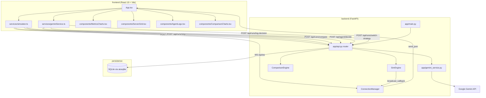
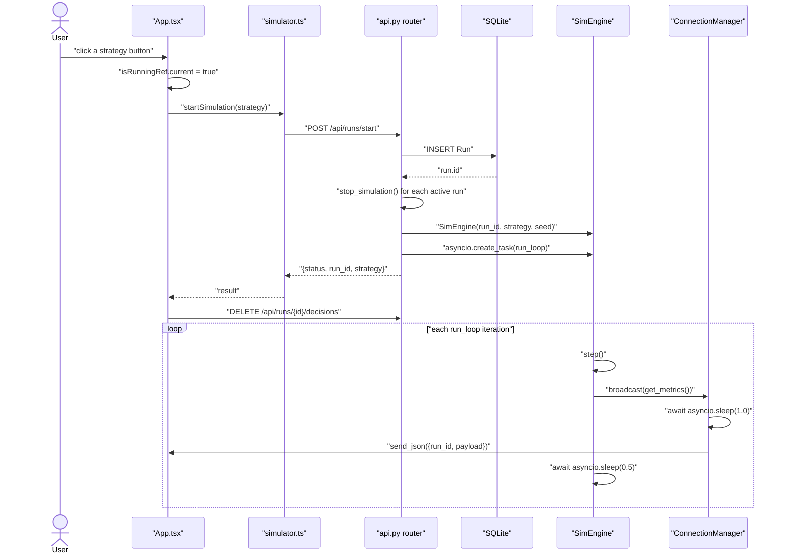
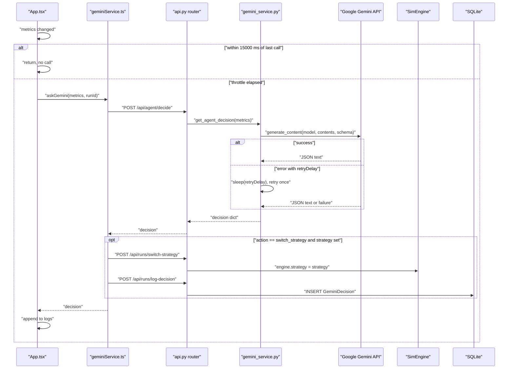
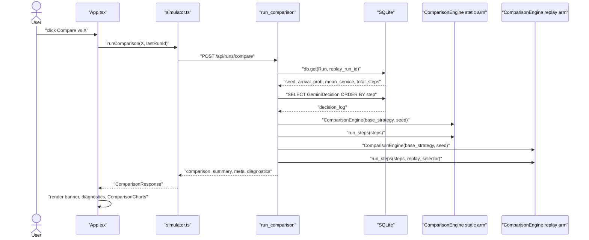
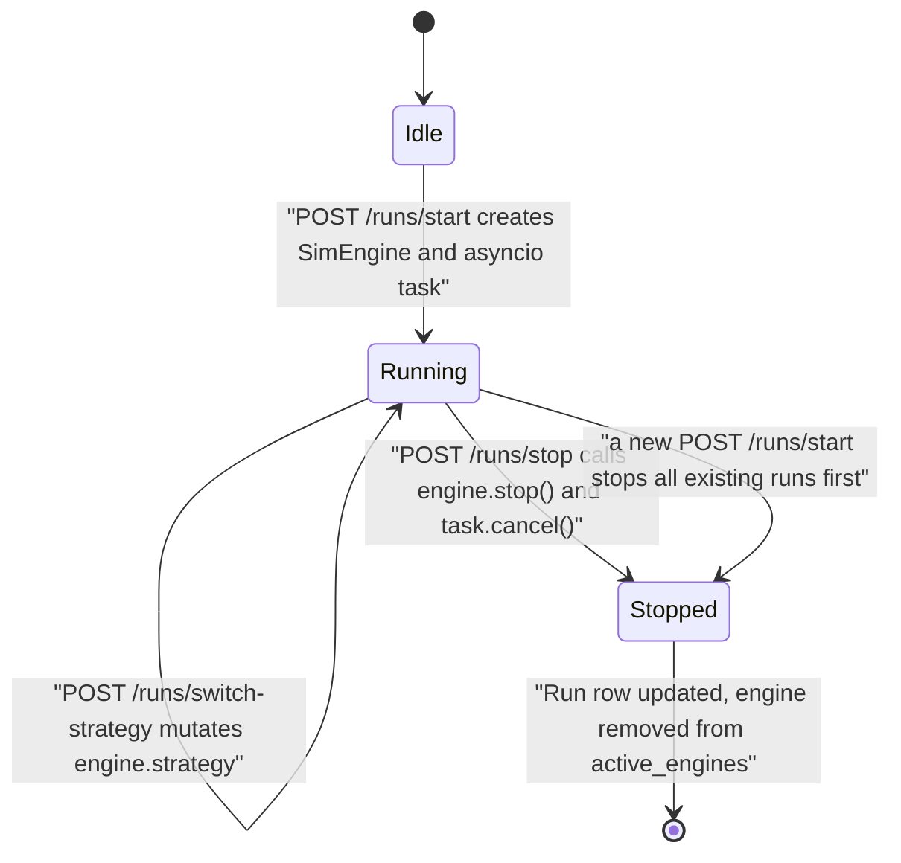
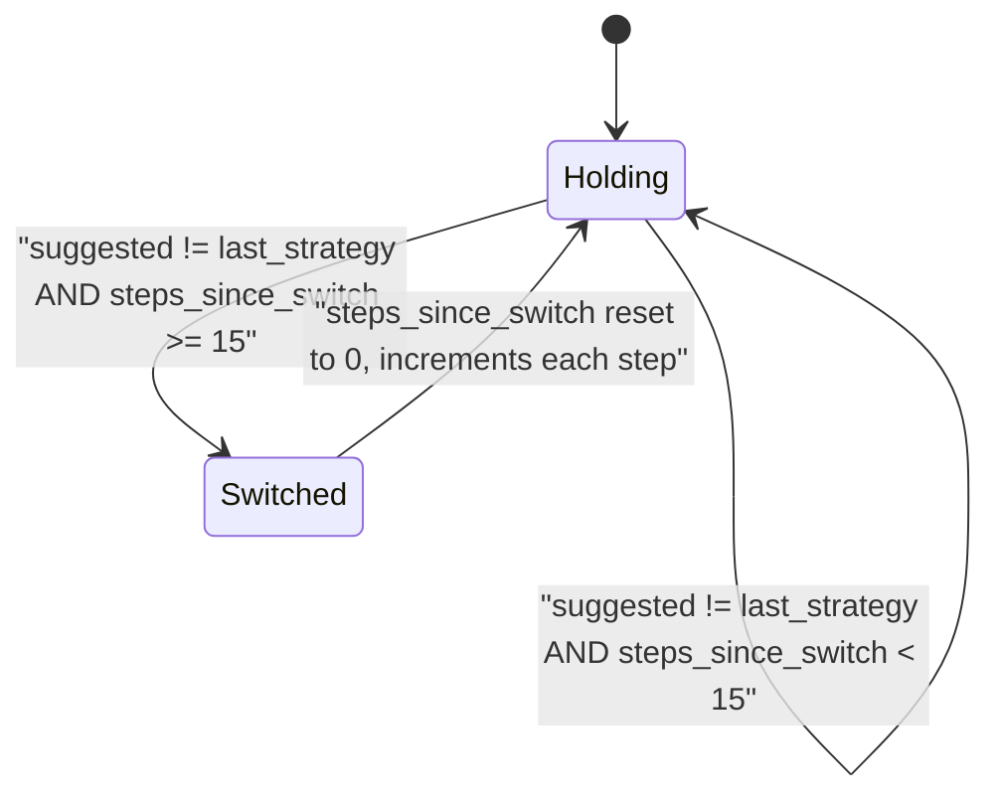
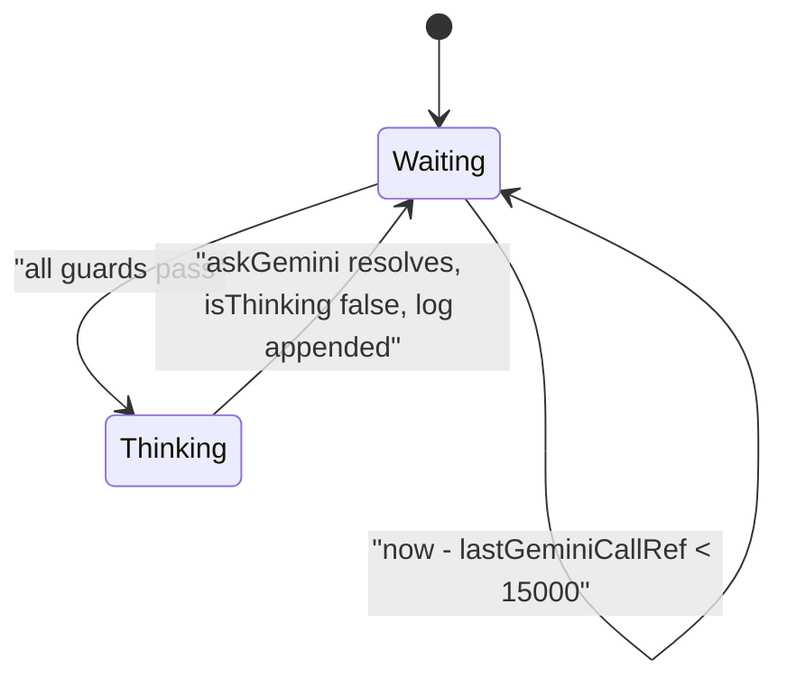

# SchedulerAI Orchestrator — Technical Deep Dive

> **Scope and method.** Everything below was derived by reading the source files in this
> repository. Every technical claim carries a citation of the form `path:Lstart-Lend`.
> Claims made by `README.md`, `interview_prep_guide.md`, comments, and docstrings are
> treated as *assertions to be verified*, not as evidence — where they disagree with the
> code, that is recorded in [§13 Discrepancies](#13-discrepancies).
>
> Nothing was built, installed, or executed. The one runtime artifact consulted is
> `backend/simulation.db`, a SQLite file present in the working tree. **It is not tracked
> by git** — `.gitignore:19` lists `*.db`, and `git ls-files backend/` returns only
> `Dockerfile`, `requirements.txt`, `start.sh`, and the eight `app/*.py` files. It is
> therefore local developer state, not a committed result file, and is cited as such.

---

## Table of Contents

1. [Overview](#1-overview)
2. [Repository Map](#2-repository-map)
3. [Tech Stack & Dependencies](#3-tech-stack--dependencies)
4. [System Architecture](#4-system-architecture)
5. [Entry Points & How It Runs](#5-entry-points--how-it-runs)
6. [Component Deep Dives](#6-component-deep-dives)
7. [Runtime Data Flow](#7-runtime-data-flow)
8. [ROS 2 Interface](#8-ros-2-interface)
9. [LLM Integration Pipeline](#9-llm-integration-pipeline)
10. [Control Logic & State Machines](#10-control-logic--state-machines)
11. [Configuration Reference](#11-configuration-reference)
12. [Implementation Status](#12-implementation-status)
13. [Discrepancies](#13-discrepancies)
14. [Limitations Visible in Code](#14-limitations-visible-in-code)
15. [Needs Author Input](#15-needs-author-input)

---

## 1. Overview

This repository implements a discrete-step simulation of a job scheduler over a fixed set
of 8 in-process "server" objects, wrapped in a FastAPI backend and a React dashboard. A
`SimEngine` instance advances one simulation step at a time — injecting job arrivals,
executing one of five named assignment strategies, decrementing work counters, and
injecting random server failures — and pushes a metrics snapshot to all connected
WebSocket clients after each step (`backend/app/scheduler_engine.py:106-143`,
`backend/app/scheduler_engine.py:66-78`). The React dashboard consumes that stream and, at
most once per 15 000 ms, forwards the latest snapshot to `POST /api/agent/decide`
(`frontend/App.tsx:65`, `frontend/App.tsx:87-103`), which calls the Gemini API server-side
with a fixed system prompt and a constrained JSON response schema
(`backend/app/gemini_service.py:166-181`). When the model returns `action ==
"switch_strategy"`, the frontend issues two further requests — one that mutates the live
engine's `strategy` attribute in place, and one that appends a row to the
`GeminiDecision` table (`frontend/services/geminiService.ts:29-57`,
`backend/app/api.py:116-126`, `backend/app/api.py:76-87`). A separate synchronous
`ComparisonEngine` re-simulates a stored run twice from the same seed — once on a fixed
strategy and once replaying the logged decisions — and returns both trajectories for
side-by-side charting (`backend/app/api.py:461-600`).

---

## 2. Repository Map

| Path | Role |
|---|---|
| `backend/app/main.py` | FastAPI application object; CORS middleware; `lifespan` calls `init_db()`; mounts the router at `/api` (`backend/app/main.py:8-29`) |
| `backend/app/api.py` | Every HTTP and WebSocket route, the `ConnectionManager`, the module-level engine registries, and the entire `ComparisonEngine` (`backend/app/api.py:20-600`) |
| `backend/app/scheduler_engine.py` | `Job`, `Server`, `SimEngine` and the five live strategy methods (`backend/app/scheduler_engine.py:15-304`) |
| `backend/app/gemini_service.py` | Gemini client construction, `SYSTEM_PROMPT`, response schema, retry logic (`backend/app/gemini_service.py:13-210`) |
| `backend/app/models.py` | Three SQLModel tables: `Run`, `JobLog`, `GeminiDecision` (`backend/app/models.py:5-34`) |
| `backend/app/database.py` | Async SQLAlchemy engine, `init_db()`, `get_session()` dependency (`backend/app/database.py:10-22`) |
| `backend/app/config.py` | `Settings` class defining six settings, five of them read from environment variables (`backend/app/config.py:3-15`) |
| `backend/app/__init__.py` | Empty file |
| `backend/Dockerfile` | `python:3.11-slim`; installs `build-essential`; `CMD uvicorn app.main:app --host 0.0.0.0 --port 8000` (`backend/Dockerfile:1-22`) |
| `backend/requirements.txt` | Ten pinned Python dependencies (`backend/requirements.txt:1-10`) |
| `backend/start.sh` | **Empty file.** Zero bytes; git-tracked but contains nothing |
| `backend/simulation.db` | SQLite database, untracked (`.gitignore:19`). Contains 43 `run` rows, 0 `joblog` rows, 48 `geminidecision` rows |
| `calculate_metrics.py` | Standalone benchmark script containing an independent third copy of `ComparisonEngine` (`calculate_metrics.py:14-213`) |
| `frontend/App.tsx` | Root component: WebSocket subscription, throttled agent loop, start/stop/compare handlers, full dashboard layout (`frontend/App.tsx:40-318`) |
| `frontend/constants.ts` | `API_BASE_URL`, `WEBSOCKET_URL`, and a `SYSTEM_PROMPT` copy that nothing imports (`frontend/constants.ts:3-117`) |
| `frontend/types.ts` | `ServerStatus`, `MetricsPayload`, `StrategyName`, `AgentDecision`, comparison types (`frontend/types.ts:3-62`) |
| `frontend/services/simulator.ts` | `startSimulation`, `stopSimulation`, `connectWebSocket`, `runComparison` (`frontend/services/simulator.ts:6-86`) |
| `frontend/services/geminiService.ts` | `askGemini` — POSTs to the backend proxy, then actuates and logs (`frontend/services/geminiService.ts:6-60`) |
| `frontend/components/MetricsCharts.tsx` | Live queue-length line chart + per-server completion bar chart (`frontend/components/MetricsCharts.tsx:12-69`) |
| `frontend/components/ServerGrid.tsx` | 8-tile cluster grid (`frontend/components/ServerGrid.tsx:9-44`) |
| `frontend/components/AgentLogs.tsx` | Right sidebar listing agent decisions (`frontend/components/AgentLogs.tsx:9-59`) |
| `frontend/components/ComparisonCharts.tsx` | Three comparison line charts + four summary tiles (`frontend/components/ComparisonCharts.tsx:12-191`) |
| `frontend/vite.config.ts` | Vite config: port 3000, `strictPort`, React + Tailwind plugins, `@` alias (`frontend/vite.config.ts:10-22`) |
| `frontend/index.html` | HTML shell; references `/favicon.svg` and `/index.tsx` (`frontend/index.html:7-8`, `frontend/index.html:40`) |
| `frontend/.env.local` | **Empty file** |
| `render.yaml` | Two Render service definitions (`render.yaml:1-37`) |
| `README.md`, `interview_prep_guide.md` | Prose documentation; see [§13](#13-discrepancies) |

---

## 3. Tech Stack & Dependencies

### Backend — pinned in `backend/requirements.txt:1-10`

| Package | Pinned version |
|---|---|
| `fastapi` | 0.109.0 |
| `uvicorn[standard]` | 0.27.0 |
| `sqlmodel` | 0.0.14 |
| `aiosqlite` | 0.19.0 |
| `websockets` | 14.1 |
| `httpx` | 0.28.1 |
| `python-multipart` | 0.0.6 |
| `numpy` | 1.26.3 |
| `asyncio` | 3.4.3 |
| `google-genai` | 1.30.0 |

Python base image is `python:3.11-slim` (`backend/Dockerfile:1`).

> `asyncio==3.4.3` is a PyPI distribution, not the standard library module. It is listed as
> a dependency (`backend/requirements.txt:9`) but no source file imports anything from it
> that would not resolve to the stdlib `asyncio`. See [§14](#14-limitations-visible-in-code).

### Frontend — `frontend/package.json:11-24`

| Package | Range |
|---|---|
| `react`, `react-dom` | ^19.2.0 |
| `recharts` | ^3.5.1 |
| `lucide-react` | ^0.555.0 |
| `vite` | ^6.2.0 |
| `@vitejs/plugin-react` | ^5.0.0 |
| `tailwindcss`, `@tailwindcss/vite` | ^4.0.0 |
| `typescript` | ~5.8.2 |
| `@types/node` | ^22.19.1 |

TypeScript targets `ES2022` with `jsx: "react-jsx"` and `noEmit: true`
(`frontend/tsconfig.json:3`, `frontend/tsconfig.json:21`, `frontend/tsconfig.json:28`).

**There is no `@google/genai` entry in `frontend/package.json`.** The Gemini SDK is a
backend dependency only (`backend/requirements.txt:10`).

---

## 4. System Architecture



**Reading the diagram.** `main.py` constructs the `FastAPI` object and includes the
`api.py` router under the `/api` prefix (`backend/app/main.py:15-29`). All simulation
state lives in two module-level dictionaries inside `api.py` —
`active_engines: Dict[int, SimEngine]` and `active_tasks: Dict[int, asyncio.Task]`
(`backend/app/api.py:50-51`) — so the engine and the WebSocket manager share one process's
memory. `SimEngine.run_loop` receives `manager.broadcast` as its callback
(`backend/app/api.py:194`), which is the only path from simulation to browser. The
`ComparisonEngine` never touches `active_engines`; it is constructed fresh per request
inside `run_comparison` (`backend/app/api.py:508-525`).

---

## 5. Entry Points & How It Runs

### 5.1 Backend ASGI application

`app` is created at `backend/app/main.py:15-18` with a `lifespan` context manager whose
startup half awaits `init_db()` (`backend/app/main.py:8-12`). `init_db()` opens a
transaction and runs `SQLModel.metadata.create_all` (`backend/app/database.py:12-15`).

The Docker image launches it with:

```
CMD ["uvicorn", "app.main:app", "--host", "0.0.0.0", "--port", "8000"]
```
(`backend/Dockerfile:22`)

`README.md:443` gives `uvicorn app.main:app --reload` for local use, and
`README.md:577` gives `uvicorn app.main:app`.

### 5.2 Frontend

`frontend/index.html:40` loads `/index.tsx`, which mounts `<App />` into `#root` and
throws if that element is absent (`frontend/index.tsx:6-14`). npm scripts are `dev`,
`build`, and `preview`, all thin Vite wrappers (`frontend/package.json:6-10`). The dev
server binds port 3000 with `strictPort: true` (`frontend/vite.config.ts:11-15`).

### 5.3 Standalone benchmark script

`calculate_metrics.py` has no `if __name__ == "__main__":` guard — the experiment loop at
`calculate_metrics.py:244-279` and all printing at `calculate_metrics.py:291-410` execute
on import. It sweeps 5 strategies × 10 seeds × 500 steps (`calculate_metrics.py:230-233`).
Nothing in `backend/` or `frontend/` imports it.

### 5.4 Deployment descriptor

`render.yaml:3-19` defines `schedulerai-backend` as a Docker web service built from
`./backend/Dockerfile`, health-checked at `/`, with `GEMINI_API_KEY` marked `sync: false`
and `CORS_ORIGINS` set to `https://schedulerai-frontend-qdi1.onrender.com`.
`render.yaml:22-36` defines `schedulerai-frontend` as a static site built with
`npm install && npm run build`, published from `dist`, with `VITE_API_BASE_URL` and
`VITE_WEBSOCKET_URL` pointing at `https://schedulerai-backend-qdi1.onrender.com` and
`wss://schedulerai-backend-qdi1.onrender.com/api/ws`, plus a catch-all rewrite to
`/index.html`.

The comment at `render.yaml:15-19` states that no persistent disk is attached on the free
plan, so `DATABASE_URL` falls back to the Dockerfile default
`sqlite+aiosqlite:///simulation.db` (`backend/Dockerfile:19`) on ephemeral container
storage.

### 5.5 Reproduction commands present in the repo

`README.md:580-587` contains two `curl` invocations against `/api/runs/start` and
`/api/runs/compare`. These are the only run commands committed to the repository.

---

## 6. Component Deep Dives

### 6.1 `Job` and `Server` — `backend/app/scheduler_engine.py:15-31`

`Job.__init__` assigns `self.id = str(uuid.uuid4())[:8]`, stores `arrival_time` and
`work_required`, and computes `self.hash_id = int(self.id, 16)`
(`backend/app/scheduler_engine.py:16-20`). *Library behavior:* a UUID4 string places its
first hyphen at index 8, so the eight-character slice is always pure hexadecimal and the
`int(..., 16)` conversion is total.

`Server.__init__` initialises `sid`, `busy`, `current_job`, `completed_count`,
`work_remaining`, `backoff_until`, `failed`, and `failure_duration`
(`backend/app/scheduler_engine.py:23-31`).

### 6.2 `SimEngine` — `backend/app/scheduler_engine.py:33-304`

**Responsibility.** Own the live, asynchronously-advanced simulation for one run.

**Inputs.** Constructor parameters `run_id: int`, `strategy: str`, `arrival_prob: float`,
`mean_service: float`, `seed: int`, `num_servers: int = 8`
(`backend/app/scheduler_engine.py:34`).

**Outputs.** The dict returned by `get_metrics()` (`backend/app/scheduler_engine.py:281-304`),
delivered through the `broadcast_callback` passed to `run_loop`.

#### Seeding

```python
random.seed(seed)
np.random.seed(seed)
```
(`backend/app/scheduler_engine.py:42-43`)

This reseeds the **global** `random` and `numpy.random` modules. `SimEngine` holds no
per-instance RNG. (`ComparisonEngine` does — see [§6.6](#66-comparisonengine--backendappapipy264-440).)

#### `run_loop` — `backend/app/scheduler_engine.py:66-78`

```python
while self.running:
    self.step()
    metrics = self.get_metrics()
    await broadcast_callback(metrics)
    await asyncio.sleep(0.5)
```

The loop has **no step-count termination condition**. It runs until `stop()` sets
`self.running = False` (`backend/app/scheduler_engine.py:80-81`) or the task is cancelled.
`sim_steps` is never consulted here.

**Effective step period.** `broadcast_callback` is `manager.broadcast`
(`backend/app/api.py:194`), whose first statement is `await asyncio.sleep(1.0)`
(`backend/app/api.py:39`). That await is inside the loop body, so each iteration costs
1.0 s + 0.5 s. This is corroborated by the untracked `backend/simulation.db`: run 43
records `start_time = 2026-08-20 14:24:28.115300`, `end_time = 2026-08-20 14:29:30.940981`,
and `total_steps = 202` — 302.825681 s over 202 steps, or 1.499 s per step.

#### `_get_dynamic_arrival_prob` — `backend/app/scheduler_engine.py:83-104`

A five-branch step function on `self.time_step`, scaled by `self.arrival_prob / 0.6` and
clamped to `[0.0, 1.0]`:

| `time_step` range | `base` | Source line |
|---|---|---|
| `<= 80` | 0.3 | `backend/app/scheduler_engine.py:92-93` |
| `81`–`180` | 0.95 | `backend/app/scheduler_engine.py:94-95` |
| `181`–`300` | 0.6 | `backend/app/scheduler_engine.py:96-97` |
| `301`–`400` | 0.4 | `backend/app/scheduler_engine.py:98-99` |
| `> 400` | 0.85 | `backend/app/scheduler_engine.py:100-101` |

```python
scale = self.arrival_prob / 0.6
return max(0.0, min(1.0, base * scale))
```
(`backend/app/scheduler_engine.py:103-104`)

#### `step()` — `backend/app/scheduler_engine.py:106-143`

Ordered phases, exactly as coded:

1. `self.time_step += 1` (`:107`)
2. `self._process_failures()` (`:108`)
3. Queue-rate EMA: `self.queue_rate = 0.8 * self.queue_rate + 0.2 * queue_diff`, where
   `queue_diff = len(self.queue) - self.last_queue_len` (`:111-113`)
4. Arrival: if `random.random() < current_arrival_prob`, append a `Job` whose
   `work_required` is `max(1, int(random.expovariate(1.0 / self.mean_service)))` (`:116-120`)
5. Strategy dispatch via a five-branch `if/elif` chain on `self.strategy` (`:123-132`).
   **An unrecognised strategy string silently performs no assignment** — there is no
   `else` clause.
6. Work: every busy server decrements `work_remaining`; at `<= 0`, `_complete_job` runs (`:135-140`)
7. `self._check_deadlock()` (`:143`)

Note that the EMA at step 3 is computed *before* the arrival at step 4, so `queue_rate`
always lags the current queue by one step.

#### `_process_failures` — `backend/app/scheduler_engine.py:145-163`

For each server: if already `failed`, decrement `failure_duration` and clear the flag at
`<= 0` (`:148-152`). **Otherwise** — the `elif` matters, a recovering server cannot re-fail
in the same step — draw `random.random() < 0.005` (`:155`). On failure, set
`failure_duration = random.randint(10, 30)` (`:157`) and, if the server was busy, push its
in-flight job back with `self.queue.appendleft(server.current_job)` — front of queue, not
back (`:160`).

#### `_check_deadlock` — `backend/app/scheduler_engine.py:181-185`

```python
time_since_last = self.time_step - self.last_completion_step
if time_since_last > self.deadlock_threshold and len(self.queue) > 5:
    self.deadlock_detected = True
```

`deadlock_threshold` is `50` (`backend/app/scheduler_engine.py:58`). The flag is
write-only — **nothing ever sets it back to `False`**, and nothing in `step()` or
`run_loop` reacts to it. Its only consumers are the metrics payload
(`backend/app/scheduler_engine.py:292`) and the `Run.deadlock_occurred` column written at
stop (`backend/app/api.py:224`).

#### The five live strategies

| Strategy | Method | Skips `failed` servers? |
|---|---|---|
| `baseline` | `backend/app/scheduler_engine.py:189-197` | **Yes** — `:191` |
| `random_backoff` | `backend/app/scheduler_engine.py:199-227` | **No** — `:202-205` filters only on `busy` and `backoff_until` |
| `consistent_hash` | `backend/app/scheduler_engine.py:229-240` | **Yes** — `:237` |
| `token_ring` | `backend/app/scheduler_engine.py:242-250` | **No** — `:248` checks only `busy` |
| `leader_election` | `backend/app/scheduler_engine.py:252-274` | **No** — `:264` checks only `busy` and leader identity |

**`_strategy_baseline`** sorts free, non-failed servers by `sid` and pops one job per
server from the queue front (`backend/app/scheduler_engine.py:191-197`).

**`_strategy_random_backoff`** is the only strategy with a contention model. It builds
`ready_servers` from servers that are not busy and whose `backoff_until` has elapsed
(`:202-205`). If `len(ready_servers) > 1 and len(self.queue) < len(ready_servers)` — more
contenders than jobs — it shuffles, gives the front job to `ready_servers[0]`, and sets
every loser's `backoff_until = self.time_step + random.randint(2, 6)` (`:212-221`).
Otherwise each ready server takes a job in list order (`:222-227`).

**`_strategy_consistent_hash`** snapshots the queue, computes
`preferred_sid = job.hash_id % self.num_servers`, then probes forward around the ring for
the first free, non-failed server, calling `self.queue.remove(job)` on a hit
(`:230-240`). *Library behavior:* `deque.remove` is a linear scan, so the loop is quadratic
in queue length.

**`_strategy_token_ring`** sets `self.token_position = (self.time_step // 2) % self.num_servers`
and lets only that holder claim at most one job (`:245-250`). The assignment is a direct
function of `time_step`, so `self.token_position` carries no state between calls.

**`_strategy_leader_election`** re-elects every `LEADER_EPOCH_LEN` steps — 20
(`backend/app/scheduler_engine.py:64`) — when `self.time_step % self.LEADER_EPOCH_LEN == 0`,
choosing `sorted(self.servers, key=lambda s: s.completed_count, reverse=True)[0].sid`
(`:255-259`). It then drains the queue to non-leader free workers, and only assigns to the
leader itself once `free_workers` is exhausted (`:264-274`).

> The docstring at `:256-257` says ties are broken randomly. `sorted` is stable, so ties
> resolve to the lowest `sid` among equals, deterministically. No randomness is invoked.

#### `get_metrics` — `backend/app/scheduler_engine.py:281-304`

Returns `{"run_id": ..., "payload": {...}}`. The payload keys are `time`, `queue_len`,
`queue_rate` (rounded to 3 dp, `:289`), `num_failed`, `completed_total`,
`deadlock_detected`, `strategy`, `fairness_std` (`float(np.std(completed_counts))`, `:294`),
and `servers` — a list of `{sid, busy, completed, failed}` (`:295-302`).

#### Parameters

| Parameter | Default | Source |
|---|---|---|
| `num_servers` | 8 | `backend/app/scheduler_engine.py:34` |
| `deadlock_threshold` | 50 | `backend/app/scheduler_engine.py:58` |
| `LEADER_EPOCH_LEN` | 20 | `backend/app/scheduler_engine.py:64` |
| Per-server per-step failure probability | 0.005 | `backend/app/scheduler_engine.py:155` |
| Failure duration | `randint(10, 30)` | `backend/app/scheduler_engine.py:157` |
| Backoff duration | `randint(2, 6)` | `backend/app/scheduler_engine.py:221` |
| EMA smoothing | 0.8 / 0.2 | `backend/app/scheduler_engine.py:112` |
| Loop sleep | 0.5 s | `backend/app/scheduler_engine.py:78` |

### 6.3 `ConnectionManager` — `backend/app/api.py:24-44`

Holds `active_connections: Set[WebSocket]` (`:26`). `connect` accepts and adds (`:28-30`);
`disconnect` uses `discard` (`:32-33`). `broadcast` sleeps 1.0 s once per call — the
comment at `:36-38` explains this replaced a per-connection sleep — then iterates a
snapshot `list(...)` and discards any connection whose `send_json` raises (`:39-44`).

Sends are sequential and awaited, so one slow client delays every subsequent client in the
same broadcast.

### 6.4 HTTP and WebSocket routes — `backend/app/api.py`

#### `POST /api/runs/start` — `backend/app/api.py:163-197`

1. Insert a `Run` row from the request body, commit, refresh to obtain `id` (`:168-179`)
2. Stop every currently-active run by iterating `list(active_tasks.keys())` (`:182-183`)
3. Construct `SimEngine(run_id=..., strategy=..., arrival_prob=..., mean_service=..., seed=...)`
   — **`num_servers` is not passed**, so the constructor default of 8 applies (`:185-191`)
4. Register the engine and `asyncio.create_task(engine.run_loop(manager.broadcast))` (`:193-195`)
5. Return `{"status": "started", "run_id": run_id, "strategy": req.strategy}` (`:197`)

`StartRunRequest` defaults: `sim_steps=2000`, `arrival_prob=0.4`, `mean_service=5.0`,
`seed=42` (`backend/app/api.py:54-59`). The frontend overrides all four — see
[§6.8](#68-frontend-service-layer).

#### `POST /api/runs/stop` and `stop_simulation` — `backend/app/api.py:200-228`

`stop_simulation` calls `engine.stop()`, cancels the task and awaits it inside
`try/except asyncio.CancelledError` (`:209-217`), then writes `end_time`,
`total_completed` (summed from `engine.servers`), `total_steps`, and `deadlock_occurred`
to the `Run` row (`:219-226`). `Run.avg_wait_time` is **not** written here or anywhere
else.

#### `POST /api/runs/switch-strategy` — `backend/app/api.py:116-126`

404 if the `run_id` is not in `active_engines` (`:118-119`); 400 if the strategy is not in
the hardcoded list `["baseline", "random_backoff", "consistent_hash", "token_ring", "leader_election"]`
(`:121-123`); otherwise mutates `active_engines[req.run_id].strategy` in place (`:125`).

This list is a third literal copy of the strategy names, alongside
`_STRATEGY_ENUM` (`backend/app/gemini_service.py:128`) and the TypeScript `StrategyName`
union (`frontend/types.ts:30-35`).

#### Decision-log routes — `backend/app/api.py:76-108`

`POST /runs/log-decision` inserts a `GeminiDecision` (`:76-87`). `LogDecisionRequest`
defaults `action` to `"switch_strategy"` and `raw_message` to `""`
(`backend/app/api.py:70-71`). `GET /runs/{run_id}/decisions` returns rows ordered by
`step` (`:90-98`). `DELETE /runs/{run_id}/decisions` selects then deletes them one at a
time (`:101-108`).

#### `POST /api/agent/decide` — `backend/app/api.py:141-148`

Validates into `AgentDecideRequest` (`:129-138`), calls
`req.model_dump(exclude_none=True)`, and awaits `get_agent_decision(metrics)` (`:146-147`).
Required fields are `time`, `queue_len`, `completed_total`, `fairness_std`, `queue_rate`,
`num_failed`, `servers`; `run_id` and `strategy` are optional (`:130-138`).

#### `WS /api/ws` — `backend/app/api.py:153-160`

Accepts, then loops on `await websocket.receive_text()` purely to detect disconnect
(`:157-159`). The client never sends anything — `connectWebSocket` registers only
`onopen`, `onmessage`, `onerror`, `onclose` (`frontend/services/simulator.ts:41-57`).

#### `GET /api/runs` and `DELETE /api/runs/clear-all` — `backend/app/api.py:231-246`

Listing is `Run.id` descending with `skip`/`limit` defaults 0 and 10 (`:232-235`).
`clear-all` issues bulk deletes against `JobLog`, `GeminiDecision`, and `Run` in that
order (`:241-243`).

#### `GET /` — `backend/app/main.py:31-33`

Returns `{"message": "SchedulerAI Backend Operational"}`. This is the Render health-check
path (`render.yaml:9`).

### 6.5 `gemini_service` — `backend/app/gemini_service.py`

**Model.** `GEMINI_MODEL = "gemini-3.6-flash"` (`backend/app/gemini_service.py:13`).

**Client.** `_get_client()` lazily constructs a module-global `genai.Client(api_key=...)`
and raises `RuntimeError("GEMINI_API_KEY is not configured on the server")` when the key is
empty (`:152-158`).

**Schema.** `_RESPONSE_SCHEMA` is a `types.Schema` object requiring `action` and `message`;
`action` is enum-constrained to `["switch_strategy", "explain"]`, `strategy` is nullable and
enum-constrained to the five names, and `params` is a nullable object with optional
`priority`, `target_server`, and `reason` (`:130-147`).

**Single call.** `_call_gemini_once` wraps the blocking SDK call in `asyncio.to_thread`
(`:167-177`), passing `contents=str(metrics)` — the Python `repr` of the metrics dict, not
JSON — with `system_instruction=SYSTEM_PROMPT`, `response_mime_type="application/json"`,
and `response_schema=_RESPONSE_SCHEMA`. An empty `response.text` raises
`RuntimeError("Empty response from Gemini")` (`:178-179`). `json` is imported inside the
function body (`:180`).

**Retry.** `get_agent_decision` tries once. On any exception it logs, then calls
`_parse_retry_delay`, which regex-matches `"retryDelay"\s*:\s*"(\d+)s"` against `str(error)`
and returns `0.0` on no match (`:161-163`). If the delay is positive it sleeps and retries
exactly once; a second failure returns
`{"action": "explain", "strategy": None, "params": {}, "message": "Agent rate-limited. Decision making paused."}`
(`:194-204`). If no `retryDelay` was parseable, it returns
`"Agent connection interrupted. Decision making offline."` without retrying (`:205-210`).

Because the regex requires whole seconds, a delay formatted as `"1.5s"` matches nothing and
the call degrades without retrying.

### 6.6 `ComparisonEngine` — `backend/app/api.py:264-440`

**Responsibility.** Synchronous, WebSocket-free re-simulation used only by
`/api/runs/compare`.

**RNG isolation.** Unlike `SimEngine`, this class owns per-instance streams:

```python
self.rng = random.Random(seed)
self.np_rng = np.random.RandomState(seed)
```
(`backend/app/api.py:277-278`)

`self.rng` is used for failures, failure duration, arrivals, service times, and
`random_backoff`'s shuffle (`:332`, `:334`, `:351-352`, `:404`). `self.np_rng` is assigned
but never read — `_fairness_std` calls the module-level `np.std` (`:388`).

**State shape.** Servers are plain dicts, not `Server` objects:
`{"sid", "busy", "work_remaining", "completed", "current_job", "failed", "failure_duration"}`
(`:285-289`). There is no `backoff_until` key — the class cannot represent backoff state.

**`_get_dynamic_arrival_prob`** (`:298-317`) is numerically identical to `SimEngine`'s,
including the `/0.6` scaling and the clamp.

**`run_steps(num_steps, strategy_fn=None)`** — `backend/app/api.py:319-384`. Per step:

1. `time_step += 1`, `steps_since_switch += 1` (`:322-323`)
2. Failure processing, accumulating `num_failed` (`:326-342`)
3. Queue-rate EMA (`:345-347`)
4. Arrival draw (`:350-353`); queued jobs are dicts `{"arrival", "work", "id"}` where
   **`id` is the arrival `time_step`** (`:353`)
5. **The switch gate** (`:356-363`):

```python
current_strategy = self.strategy
if strategy_fn:
    suggested_strategy = strategy_fn(len(self.queue), self._fairness_std(), num_failed, self.queue_rate)
    if suggested_strategy != self.last_strategy and self.steps_since_switch >= 15:
        self.last_strategy = suggested_strategy
        self.steps_since_switch = 0
    current_strategy = self.last_strategy
    self.strategy = current_strategy
```

6. `self._execute_strategy(current_strategy)` (`:366`)
7. Work decrement and completion (`:369-375`)
8. Append `{time, queue_len, completed_total, fairness_std, strategy}` to
   `metrics_history` (`:378-384`)

The hard-coded `15` at `:359` is a hysteresis floor applied to **every** `strategy_fn`,
including the replay function. Its consequences are analysed in
[§6.7](#67-runcomparison-and-replay-semantics--backendappapipy461-600).

**`_execute_strategy`** — `backend/app/api.py:390-440`. `free_servers` is built once at the
top from servers that are neither busy nor failed (`:391`); because `self.servers` is built
in `sid` order (`:285-289`), this list is already ascending by `sid`.

| Branch | Lines | Behaviour |
|---|---|---|
| `baseline` | `:393-400` | Sorts `free_servers` by `sid` (already sorted) and assigns one job each |
| `random_backoff` | `:402-410` | `self.rng.shuffle(free_servers)` then assigns one job each. **No contention test, no backoff, no `backoff_until`** |
| `consistent_hash` | `:412-423` | `preferred = hash(job["id"]) % self.num_servers`, then ring probe |
| `token_ring` | `:425-432` | `token_pos = (self.time_step // 2) % self.num_servers`; assigns if free **and not failed** |
| `leader_election` | `:434-440` | Assigns one job to each server in `free_servers`. **No leader, no epoch, no election** |

Three of these diverge materially from their `SimEngine` counterparts:

- **`random_backoff`** has no backoff mechanism at all. Since `free_servers` is shuffled
  but then *every* member takes a job, the shuffle changes only which server gets which
  job — never how many jobs are dispatched.
- **`leader_election`** iterates `free_servers` assigning one job each. `baseline` does the
  same after a sort that is a no-op on an already-sorted list. **The two branches are
  behaviourally identical**, and neither consumes RNG, so for a given seed they produce
  identical trajectories.
- **`token_ring`** additionally skips failed holders, which `SimEngine`'s version does not
  (`backend/app/scheduler_engine.py:248`).

Also, `job["id"]` is the integer arrival step (`backend/app/api.py:353`), which is then
passed to `hash()` at `backend/app/api.py:414`. *Library behavior:* CPython's `hash` is the
identity function on small non-negative integers. `preferred` therefore reduces to
`arrival_step % 8` — a round-robin over arrival order rather than a hash of job identity.
`SimEngine` instead hashes a UUID-derived integer (`backend/app/scheduler_engine.py:20`,
`backend/app/scheduler_engine.py:232`).

### 6.7 `run_comparison` and replay semantics — `backend/app/api.py:461-600`

**Config resolution** (`:479-505`). When `replay_run_id` is supplied, the run is fetched
(404 if missing, `:480-482`) and `seed`, `arrival_prob`, `mean_service` are taken from the
DB row; `steps` is `run_record.total_steps` when positive, else `req.steps` (`:485-489`).
The decision log is loaded ordered by `step` and `used_replay = len(decision_log) > 0`
(`:491-498`). Without `replay_run_id`, the four request fields are used verbatim
(`:499-505`). `ComparisonRequest` defaults are `base_strategy="baseline"`, `steps=200`,
`arrival_prob=0.4`, `mean_service=5.0`, `seed=42` (`:251-261`).

**Two arms** (`:508-542`). Both engines are constructed with the *same* `base_strategy`,
load, and `seed` (`:508-513`, `:520-525`). The static arm runs with no `strategy_fn`
(`:514`); the AI arm runs with either `replay_selector` or `gemini_strategy_selector`
(`:527-542`).

**The replay selector** (`:532-538`):

```python
def replay_selector(queue_len, fairness_std, num_failed, queue_rate):
    current_step[0] += 1
    step = current_step[0]
    if step in decision_map:
        return decision_map[step]
    past = [d for d in decision_log if d["step"] <= step]
    return past[-1]["strategy"] if past else req.base_strategy
```

It tracks its own step counter in a one-element list closure (`:530`) rather than reading
the engine's `time_step`.

**Replay is not faithful.** The selector's return value is only *adopted* when
`steps_since_switch >= 15` (`backend/app/api.py:359`). Two consequences follow from that
gate combined with the logged step spacing:

1. *Every* decision is delayed. The step-1 decision cannot be adopted until
   `steps_since_switch` reaches 15.
2. Decisions closer together than the gate can be **dropped entirely**, because the
   selector's "hold last known strategy" fallback keeps advancing to newer log entries
   while the gate is closed. In the untracked `backend/simulation.db`, run 43's logged
   decisions sit at steps 1, 21, 31, 51, 63, 73, 93, 103, 113, 123, 143, 163, 173, 185 —
   gaps of 10 to 20 steps, several below the 15-step gate.

**Response shape** (`:545-599`). Three parallel arrays — `queueLength`, `completedTotal`,
`fairnessStd` — each element `{time, withGemini, withoutGemini}` (`:551-569`); a `summary`
block of final queue and completion totals (`:581-588`); a `meta` block carrying
`used_replay`, `source_run_id`, `seed`, `steps`, `decisions_replayed` (`:589-595`); and a
`diagnostics` block computed as
`sum(1 for m in engine_gemini.metrics_history if m["strategy"] == req.base_strategy)`
and its complement (`:575-577`, `:596-599`).

The loop at `:551` indexes `engine_gemini.metrics_history` by the baseline's length; both
arms run the same `steps`, so the lengths match.

### 6.8 `gemini_strategy_selector` — `backend/app/api.py:443-458`

The heuristic used when no decision log exists. Evaluated in order:

| Order | Condition | Returns | Line |
|---|---|---|---|
| 1 | `num_failed >= 2` | `consistent_hash` | `:450-451` |
| 2 | `queue_rate > 3` | `leader_election` | `:452-453` |
| 3 | `fairness_std > 5 and queue_len < 20` | `token_ring` | `:454-455` |
| 4 | `queue_len > 30` | `random_backoff` | `:456-457` |
| — | fallback | `baseline` | `:458` |

The docstring (`:444-449`) states explicitly that this is not Gemini and must be surfaced
via `meta.used_replay` — which the frontend does (`frontend/App.tsx:277-288`).

### 6.9 Frontend service layer

**`startSimulation`** — `frontend/services/simulator.ts:6-26`. Signature defaults are
`sim_steps = 2000`, `arrival_prob = 0.6`, `mean_service = 8.0`, `seed = 1`
(`:8-11`). `App.tsx` calls it with the strategy only (`frontend/App.tsx:112`), so **these
four defaults, not the backend's, govern every run started from the UI**.

**`runComparison`** — `frontend/services/simulator.ts:75-86`. Sends only `base_strategy`
and `replay_run_id`. The comment block at `:60-74` records that it previously sent
hardcoded `200 / 0.85 / 8.0 / 42` that did not match the live run's config.

**`askGemini`** — `frontend/services/geminiService.ts:6-60`. POSTs `{...metrics, run_id}`
to `/api/agent/decide` (`:16-22`); on any throw, returns the offline fallback decision
without rethrowing (`:23-26`). Then, only when `runId !== null && decision.action ===
"switch_strategy" && decision.strategy` (`:29`), it fires `/api/runs/switch-strategy`
(`:36-40`) and `/api/runs/log-decision` (`:46-50`), both inside one `try/catch` whose
comment explains that an unhandled rejection previously froze the agent loop (`:30-33`).

**The log-decision body carries only `run_id`, `step`, and `strategy`** (`:49`) — never
`action` or `raw_message`, so the server defaults apply. This is consistent with the
untracked `backend/simulation.db`, in which every `geminidecision` row for run 43 has
`action = 'switch_strategy'` and `raw_message = ''`. Decisions with `action == "explain"`
are never persisted.

### 6.10 `App.tsx` — `frontend/App.tsx:40-318`

**State.** `metrics`, `history`, `logs`, `runId`, `isRunning`, `isThinking`, `lastRunId`,
plus three comparison fields (`:41-59`). The comment at `:47-53` explains that `lastRunId`
is deliberately not cleared on stop so comparison still works afterwards.

**WebSocket effect** (`:70-84`). Runs once on mount. Every message is dropped unless
`isRunningRef.current` is true (`:73`); otherwise it sets `metrics`, `runId`, and appends
to `history`, trimming with `newHistory.length > 50 ? newHistory.slice(1) : newHistory`
(`:77-80`).

> `slice(1)` removes exactly one element whenever the temporary `newHistory` exceeds 50,
> so the stored `history` array never exceeds 50 entries (`:78-79`).

**Agent effect** (`:87-103`). Depends on `[metrics]` (`:103`). Bails when any of
`!metrics`, `isThinking`, `!isRunningRef.current`, `!isRunning` hold (`:88`), or when
`Date.now() - lastGeminiCallRef.current < GEMINI_THROTTLE_MS` (`:90-91`).
`GEMINI_THROTTLE_MS = 15_000` (`:65`). The timestamp is written before the await (`:94`),
so the throttle window starts at request dispatch.

**`handleStart`** (`:105-128`). Sets the ref and state, awaits `startSimulation(strategy)`,
then `DELETE`s that run's decisions (`:114`) and records `lastRunId` (`:115`). Clears any
existing comparison (`:120-121`). On throw, alerts and rolls back both running flags
(`:122-127`).

**`handleStop`** (`:130-149`). Clears `isRunningRef.current` and `isRunning` *before*
awaiting `stopSimulation` (`:133-138`), then nulls `runId` and `metrics` (`:141-142`).

**`handleRunComparison`** (`:151-168`). Returns early if `lastRunId === null` (`:155`);
otherwise awaits `runComparison(strategy, lastRunId)`.

**Render.** Four stat tiles (`:201-220`); `MetricsCharts` (`:222`); `ServerGrid`, mounted
only when `metrics` is non-null (`:224`); five start buttons and five compare buttons from
the local `strategies` array (`:67`, `:231-239`, `:259-272`); the replay/heuristic banner
(`:277-288`); the diagnostics line (`:290-295`); `ComparisonCharts` (`:308`); and
`AgentLogs` in the sidebar (`:313`).

The queue tile turns red at `metrics.queue_len > 40` (`:208`). Start buttons are **not**
disabled while a run is active (`:231-239`).

### 6.11 Presentational components

**`MetricsCharts`** — `frontend/components/MetricsCharts.tsx:12-69`. Slices history to the
last 50 (`:13`); line chart on `queue_len` with the X axis hidden (`:27`, `:33-40`); bar
chart of per-server `completed` with alternating cell fills (`:50-63`). Animations are
disabled on both (`:39`, `:58`).

**`ServerGrid`** — `frontend/components/ServerGrid.tsx:9-44`. Renders one tile per server
keyed by `sid` (`:16-18`), colouring red when `busy` and emerald otherwise (`:21-23`).
**`server.failed` is never read**, so failed servers are indistinguishable from idle ones.

**`AgentLogs`** — `frontend/components/AgentLogs.tsx:9-59`. Auto-scrolls on every `logs`
change (`:12-14`); renders `key={idx}` (`:33`). The branch
`log.decision.action === 'start_run'` (`:37`) is unreachable: `AgentDecision.action` is
typed as `"switch_strategy" | "explain"` (`frontend/types.ts:42`) and the backend schema
enum permits only those two (`backend/app/gemini_service.py:133`).

**`ComparisonCharts`** — `frontend/components/ComparisonCharts.tsx:12-191`. Returns `null`
unless both `comparisonData` and `isComparing` are truthy (`:13`). Three charts, each
sliced to the last 50 points (`:47`, `:84`, `:121`), green for `withGemini` and red for
`withoutGemini` (`:16-17`).

> The four summary tiles at `:155-188` average over the **full** arrays
> (`:160`, `:168`), while the charts above them display only the last 50 points. The
> numbers and the curves therefore cover different windows.

### 6.12 `calculate_metrics.py` — a third engine

`calculate_metrics.py:12` labels its class "Inline ComparisonEngine (copied from api.py to
avoid import issues)". It has since diverged on four axes:

1. **RNG.** Reseeds the globals in `__init__` (`:16-17`) and again before each construction
   (`:248-249`, `:253-254`); `run_steps` uses module-level `random` (`:64`, `:66`, `:81-82`)
   and `_execute_strategy` calls `random.shuffle` (`:149`). The per-instance isolation that
   `api.py:277-278` introduced is absent, so a strategy that draws more RNG than its
   counterpart desynchronises the two arms.
2. **Load curve ignores `arrival_prob`.** `_get_dynamic_arrival_prob` returns the raw base
   values with no `/0.6` scaling (`:41-51`), so the module-level `ARRIVAL_PROB = 0.85`
   (`:233`) is passed to every constructor (`:250`, `:255`) and never affects arrivals.
3. **Hand-tuned strategy handicaps** absent from both production engines:
   - `baseline` stops after 2 dispatches once `len(self.queue) > 15`, commented
     "Lock contention limits throughput" (`:139-140`)
   - `random_backoff` inflates every job by one unit: `job["work"] + 1`, commented
     "Random backoff overhead" (`:154`)
   - `leader_election` returns without dispatching whenever `self.time_step % 20 == 0`,
     commented "Epoch election pause" (`:181-182`)
4. **Different heuristic.** Its `gemini_strategy_selector` (`:216-225`) uses thresholds
   `queue_len > 15 or queue_rate > 2.0` → `leader_election` first, then `num_failed >= 2`,
   `fairness_std > 5 and queue_len < 10`, `queue_len > 25` — none of which match
   `backend/app/api.py:443-458` in either order or value.

Sweep constants: `SEEDS` is a 10-element list, `STEPS = 500`, `MEAN_SERVICE = 8.0`
(`:231-234`). The codebase-stats block hardcodes absolute paths `d:/second/backend/app/*.py`
(`:385-391`).

---

## 7. Runtime Data Flow

### 7.1 Starting a run and the live tick



Sources: `frontend/App.tsx:105-121`, `frontend/services/simulator.ts:13-25`,
`backend/app/api.py:163-197`, `backend/app/scheduler_engine.py:70-78`,
`backend/app/api.py:35-44`.

### 7.2 One agent decision cycle



Sources: `frontend/App.tsx:87-103`, `frontend/services/geminiService.ts:16-59`,
`backend/app/api.py:141-148`, `backend/app/gemini_service.py:184-210`,
`backend/app/api.py:116-126`, `backend/app/api.py:76-87`.

### 7.3 Comparison request



Sources: `frontend/App.tsx:151-168`, `frontend/services/simulator.ts:75-85`,
`backend/app/api.py:479-542`, `backend/app/api.py:579-599`.

---

## 8. ROS 2 Interface

Not present in this codebase. There are no ROS packages, launch files, message
definitions, URDF/Xacro files, or TF frames anywhere in the repository.

The nearest analogue is the HTTP/WebSocket surface, tabulated below.

### 8.1 HTTP and WebSocket endpoints

| Method | Path | Request model | Returns | Source |
|---|---|---|---|---|
| `GET` | `/` | — | `{"message": ...}` | `backend/app/main.py:31-33` |
| `WS` | `/api/ws` | — | Server-pushed `{run_id, payload}` | `backend/app/api.py:153-160` |
| `POST` | `/api/runs/start` | `StartRunRequest` | `{status, run_id, strategy}` | `backend/app/api.py:163-197` |
| `POST` | `/api/runs/stop` | `StopRunRequest` | `{status, run_id}` | `backend/app/api.py:200-203` |
| `GET` | `/api/runs` | query `skip`, `limit` | `list[Run]` | `backend/app/api.py:231-235` |
| `DELETE` | `/api/runs/clear-all` | — | `{status, message}` | `backend/app/api.py:238-246` |
| `POST` | `/api/runs/switch-strategy` | `SwitchStrategyRequest` | `{status, strategy}` | `backend/app/api.py:116-126` |
| `POST` | `/api/runs/compare` | `ComparisonRequest` | `{comparison, summary, meta, diagnostics}` | `backend/app/api.py:461-600` |
| `POST` | `/api/runs/log-decision` | `LogDecisionRequest` | `{status: "logged"}` | `backend/app/api.py:76-87` |
| `GET` | `/api/runs/{run_id}/decisions` | path param | `list[GeminiDecision]` | `backend/app/api.py:90-98` |
| `DELETE` | `/api/runs/{run_id}/decisions` | path param | `{status: "cleared"}` | `backend/app/api.py:101-108` |
| `POST` | `/api/agent/decide` | `AgentDecideRequest` | decision dict | `backend/app/api.py:141-148` |

No QoS, retry, or timeout settings are configured on any route. CORS is applied globally
with `allow_methods=["*"]`, `allow_headers=["*"]`, `allow_credentials=True`
(`backend/app/main.py:21-27`).

### 8.2 Database schema — `backend/app/models.py:5-34`

| Table | Columns |
|---|---|
| `Run` | `id`, `strategy`, `seed`, `arrival_prob`, `mean_service`, `sim_steps`, `start_time`, `end_time`, `total_completed`, `total_steps`, `deadlock_occurred`, `avg_wait_time` (`:5-17`) |
| `JobLog` | `id`, `run_id` (FK `run.id`), `job_internal_id`, `arrival_step`, `completion_step`, `processed_by` (`:19-25`) |
| `GeminiDecision` | `id`, `run_id` (FK `run.id`), `step`, `strategy`, `action`, `raw_message`, `timestamp` (`:27-34`) |

`start_time` and `timestamp` default via `datetime.utcnow` (`:12`, `:34`).

### 8.3 Loop rates

| Loop | Period | Source |
|---|---|---|
| `SimEngine.run_loop` explicit sleep | 0.5 s | `backend/app/scheduler_engine.py:78` |
| `ConnectionManager.broadcast` sleep | 1.0 s | `backend/app/api.py:39` |
| **Effective step period** | 1.5 s (sum of the two awaits) | `backend/app/scheduler_engine.py:70-78` |
| Frontend agent throttle | 15 000 ms | `frontend/App.tsx:65` |

---

## 9. LLM Integration Pipeline

There is **no machine-learning model, no computer-vision pipeline, and no model weights**
in this repository. The only inference is a remote call to a hosted Gemini model.

**Model selection.** A module constant, not configurable by environment:
`GEMINI_MODEL = "gemini-3.6-flash"` (`backend/app/gemini_service.py:13`).

**Credential.** `settings.GEMINI_API_KEY` from the `GEMINI_API_KEY` environment variable,
default `""` (`backend/app/config.py:15`). `render.yaml:11-12` marks it `sync: false`.

**Prompt.** A 112-line `SYSTEM_PROMPT` string (`backend/app/gemini_service.py:15-126`)
containing: per-strategy descriptions (`:23-55`); a list of the eight metric fields the
model receives (`:59-68`); a six-step reasoning procedure (`:72-106`), whose step 5
instructs a 20–30 step hysteresis with an exception at `num_failed >= 3` (`:92-94`); and a
response-format block (`:110-126`).

**Input encoding.** `contents=str(metrics)` — the Python `repr` of the dict
(`backend/app/gemini_service.py:171`), not serialised JSON.

**Output constraint.** `response_mime_type="application/json"` plus the
`_RESPONSE_SCHEMA` object (`backend/app/gemini_service.py:174-175`,
`backend/app/gemini_service.py:130-147`). `required=["action", "message"]` (`:146`), so
`strategy` may be omitted or null.

**Postprocessing.** `json.loads(response.text)` with no validation beyond the empty-text
check (`backend/app/gemini_service.py:178-181`). The parsed dict is returned straight to
the route and then to the browser (`backend/app/api.py:147-148`). Type narrowing exists
only in TypeScript (`frontend/types.ts:37-49`) and is erased at runtime — a strategy name
outside the enum would reach `/api/runs/switch-strategy`, where it would be rejected with
HTTP 400 (`backend/app/api.py:121-123`).

**Thresholds.** The only numeric gates on the LLM path are the 15 000 ms client throttle
(`frontend/App.tsx:65`) and the `isThinking` in-flight guard (`frontend/App.tsx:88`).
No temperature, top-k, top-p, token limit, or request timeout is set anywhere.

---

## 10. Control Logic & State Machines

### 10.1 Run lifecycle as coded



Sources: `backend/app/api.py:185-195`, `backend/app/scheduler_engine.py:70-78`,
`backend/app/api.py:125`, `backend/app/api.py:206-228`, `backend/app/api.py:182-183`.

There is no `Paused` state and no transition triggered by step count or by
`deadlock_detected`.

### 10.2 Strategy adoption gate in `ComparisonEngine.run_steps`



Source: `backend/app/api.py:356-363`. `steps_since_switch` starts at 0 (`:296`) and
increments once per step (`:323`).

### 10.3 Agent-loop gating in `App.tsx`



Source: `frontend/App.tsx:88-99`. `askGemini` never rejects — it catches internally and
returns a fallback decision (`frontend/services/geminiService.ts:23-26`) — so the
`Thinking → Waiting` edge always fires.

---

## 11. Configuration Reference

### 11.1 `backend/app/config.py:2-17`

| Setting | Env var | Default | Read by |
|---|---|---|---|
| `PROJECT_NAME` | — | `"SchedulerAI Backend"` | `backend/app/main.py:16` |
| `DATABASE_URL` | `DATABASE_URL` | `sqlite+aiosqlite:///./simulation.db` | `backend/app/database.py:10` |
| `NUM_SERVERS` | `NUM_SERVERS` | `8` | **Nothing** |
| `SIM_DELAY` | `SIM_DELAY` | `0.1` | **Nothing** |
| `CORS_ORIGINS` | `CORS_ORIGINS` | `["*"]` | `backend/app/main.py:23` |
| `GEMINI_API_KEY` | `GEMINI_API_KEY` | `""` | `backend/app/gemini_service.py:155-157` |

`CORS_ORIGINS` is split on commas with whitespace stripped and empties dropped
(`backend/app/config.py:10-14`).

`NUM_SERVERS` and `SIM_DELAY` are dead: cluster size comes from the `SimEngine` default
argument (`backend/app/scheduler_engine.py:34`) and the tick from the literal `0.5`
(`backend/app/scheduler_engine.py:78`).

### 11.2 `frontend/constants.ts:3-4`

| Constant | Env var | Fallback |
|---|---|---|
| `API_BASE_URL` | `VITE_API_BASE_URL` | `http://localhost:8000` |
| `WEBSOCKET_URL` | `VITE_WEBSOCKET_URL` | `ws://localhost:8000/api/ws` |

`frontend/constants.ts:6-117` also exports `SYSTEM_PROMPT`, which no module imports.

### 11.3 Effective run parameters from the UI

Because `App.tsx:112` passes only the strategy, every UI-started run uses
`frontend/services/simulator.ts:8-11`:

| Field | Value |
|---|---|
| `sim_steps` | 2000 (stored, never enforced) |
| `arrival_prob` | 0.6 |
| `mean_service` | 8.0 |
| `seed` | 1 |

The `StartRunRequest` defaults of `2000 / 0.4 / 5.0 / 42` (`backend/app/api.py:56-59`)
apply only to direct API callers, such as the `curl` example at `README.md:582`.

### 11.4 Other configuration files

| File | Controls |
|---|---|
| `backend/Dockerfile:18-19` | `ENV PORT=8000`; `ENV DATABASE_URL="sqlite+aiosqlite:///simulation.db"` |
| `render.yaml:10-19` | Backend env: `GEMINI_API_KEY` (unsynced), `CORS_ORIGINS` |
| `render.yaml:28-36` | Frontend env: `VITE_API_BASE_URL`, `VITE_WEBSOCKET_URL`; SPA rewrite |
| `frontend/vite.config.ts:11-21` | Port 3000, `strictPort`, React + Tailwind plugins, `@` alias |
| `frontend/tsconfig.json:2-29` | ES2022, `react-jsx`, `noEmit`, `@/*` paths |
| `.gitignore:1-30` | Ignores `node_modules`, `dist`, `venv/`, `__pycache__/`, `*.pyc`, `*.db`, `.vscode/*` |
| `.vscode/settings.json` | `{"python-envs.pythonProjects": []}` |
| `frontend/index.css` | A single line: `@import "tailwindcss";` |

`ENV PORT=8000` (`backend/Dockerfile:18`) is never read — the `CMD` hardcodes
`--port 8000` (`backend/Dockerfile:22`).

---

## 12. Implementation Status

| Feature / component | Status | Citation |
|---|---|---|
| FastAPI app, CORS, lifespan `init_db` | [IMPLEMENTED] | `backend/app/main.py:8-29` |
| `SimEngine` live simulation loop | [IMPLEMENTED] | `backend/app/scheduler_engine.py:66-78`, launched at `backend/app/api.py:194` |
| `baseline` (live) | [IMPLEMENTED] | `backend/app/scheduler_engine.py:189-197` |
| `random_backoff` with contention + backoff (live) | [IMPLEMENTED] | `backend/app/scheduler_engine.py:199-227` |
| `consistent_hash` over UUID-derived ids (live) | [IMPLEMENTED] | `backend/app/scheduler_engine.py:229-240` |
| `token_ring` (live) | [IMPLEMENTED] | `backend/app/scheduler_engine.py:242-250` |
| `leader_election` with 20-step epochs (live) | [IMPLEMENTED] | `backend/app/scheduler_engine.py:252-274` |
| Random server failure + job preemption | [IMPLEMENTED] | `backend/app/scheduler_engine.py:145-163` |
| Failure-awareness in `random_backoff`, `token_ring`, `leader_election` (live) | **Not implemented** — no `failed` check | `backend/app/scheduler_engine.py:202-205`, `:248`, `:264` |
| Starvation flag (`deadlock_detected`) | [IMPLEMENTED] — set only, never cleared, never acted on | `backend/app/scheduler_engine.py:181-185` |
| WebSocket broadcast | [IMPLEMENTED] | `backend/app/api.py:35-44`, `backend/app/api.py:153-160` |
| Server-side Gemini proxy | [IMPLEMENTED] | `backend/app/api.py:141-148`, `backend/app/gemini_service.py:184-210` |
| Retry-once on parseable `retryDelay` | [IMPLEMENTED] | `backend/app/gemini_service.py:192-204` |
| Live strategy hot-swap | [IMPLEMENTED] | `backend/app/api.py:116-126`, `frontend/services/geminiService.ts:36-40` |
| Decision logging to `GeminiDecision` | [IMPLEMENTED] — `switch_strategy` only | `backend/app/api.py:76-87`, `frontend/services/geminiService.ts:29`, `:46-50` |
| `ComparisonEngine` with isolated `random.Random` | [IMPLEMENTED] | `backend/app/api.py:277` |
| Config lookup from the stored `Run` row | [IMPLEMENTED] | `backend/app/api.py:479-498` |
| Decision replay at exact logged steps | **Partially implemented** — subject to the 15-step gate | `backend/app/api.py:532-540` vs `backend/app/api.py:359` |
| `gemini_strategy_selector` heuristic fallback | [IMPLEMENTED] | `backend/app/api.py:443-458`, selected at `backend/app/api.py:527` |
| `used_replay` / `diagnostics` surfacing in UI | [IMPLEMENTED] | `frontend/App.tsx:277-295` |
| `ComparisonEngine` `random_backoff` backoff behaviour | [DEFINED, NOT WIRED] — branch exists, contention logic absent | `backend/app/api.py:402-410` |
| `ComparisonEngine` `leader_election` leader logic | [DEFINED, NOT WIRED] — branch exists, no election | `backend/app/api.py:434-440` |
| `self.np_rng` on `ComparisonEngine` | [DEFINED, NOT WIRED] — assigned, never read | `backend/app/api.py:278` |
| `JobLog` persistence | [DEFINED, NOT WIRED] — objects built in memory, never committed | `backend/app/scheduler_engine.py:173-179`; `joblog` has 0 rows in `backend/simulation.db` |
| `Run.avg_wait_time` | [DEFINED, NOT WIRED] — column exists, never assigned | `backend/app/models.py:17` vs `backend/app/api.py:219-226` |
| `sim_steps` termination | [DEFINED, NOT WIRED] — stored, never enforced | `backend/app/models.py:11` vs `backend/app/scheduler_engine.py:70` |
| `settings.NUM_SERVERS` | [DEFINED, NOT WIRED] | `backend/app/config.py:5` |
| `settings.SIM_DELAY` | [DEFINED, NOT WIRED] | `backend/app/config.py:6` |
| `frontend/constants.ts::SYSTEM_PROMPT` | [DEFINED, NOT WIRED] — exported, never imported | `frontend/constants.ts:6-117` |
| `AgentLogs` `'start_run'` branch | [DEFINED, NOT WIRED] — unreachable under the typed union | `frontend/components/AgentLogs.tsx:37` vs `frontend/types.ts:42` |
| `ServerGrid` failed-server rendering | **Not implemented** — `failed` never read | `frontend/components/ServerGrid.tsx:16-39` |
| `SQLModel.metadata.drop_all` reset | [COMMENTED OUT] | `backend/app/database.py:14` |
| `backend/start.sh` | [STUB] — empty file | `backend/start.sh` |
| `frontend/.env.local` | [STUB] — empty file | `frontend/.env.local` |
| `calculate_metrics.py` benchmark sweep | [IMPLEMENTED] as a standalone script; imported by nothing | `calculate_metrics.py:244-279` |
| `LICENSE` file | **Not present** — `README.md:10` and `README.md:599` reference it | repository root listing |

---

## 13. Discrepancies

Each item below is a documented claim that the code contradicts.

**1. Gemini model version.** `README.md:9`, `README.md:34`, and
`frontend/metadata.json:3` say Gemini 2.5 Flash; `interview_prep_guide.md:458` says
"Gemini 2.5 Flash". The code sets `GEMINI_MODEL = "gemini-3.6-flash"`
(`backend/app/gemini_service.py:13`).

**2. Gemini runs in the browser.** `README.md:118-119` routes metrics from the WebSocket
client to `geminiService.ts` and thence to the Gemini API; `README.md:533-536` and
`interview_prep_guide.md:283-285` describe the key being bundled client-side via Vite
`define`. In the current code the browser only POSTs to `/api/agent/decide`
(`frontend/services/geminiService.ts:16-22`); the SDK call is server-side
(`backend/app/gemini_service.py:166-181`); `frontend/vite.config.ts` contains no `define`
block; and `@google/genai` is not in `frontend/package.json:11-16`.

**3. Broadcast interval.** `README.md:116` says "metrics every 0.5s", `README.md:360` says
"Every 0.5 seconds", and `interview_prep_guide.md:451` says "2 ticks/sec (500ms sleep)".
Each `run_loop` iteration awaits `manager.broadcast` — which begins with
`await asyncio.sleep(1.0)` (`backend/app/api.py:39`) — and then
`await asyncio.sleep(0.5)` (`backend/app/scheduler_engine.py:78`), for 1.5 s per step. Run
43 in the untracked `backend/simulation.db` spans 302.825681 s over 202 steps, i.e.
1.499 s per step.

**4. Replay fidelity.** `README.md:332-334` states the replay engine "faithfully
reproduces" Gemini's decisions, and `README.md:289` describes the AI arm as replaying
"logged decisions at exact step numbers". `ComparisonEngine.run_steps` adopts a suggested
strategy only when `steps_since_switch >= 15` (`backend/app/api.py:359`); run 43's logged
decisions are spaced 10–20 steps apart, so some fall inside the closed gate.

**5. Load-profile third phase.** `README.md:233` states that steps 181–202 run at
`arrival_prob × 0.85/0.6 = 0.85`. For `time_step <= 300` the base is `0.6`
(`backend/app/scheduler_engine.py:96-97`); the `0.85` branch applies only above step 400
(`backend/app/scheduler_engine.py:100-101`). At `arrival_prob = 0.6` the scale is 1.0, so
steps 181–202 run at 0.6, not 0.85.

**6. "Isolated RNG instances" is specific to the comparison path.** `README.md:303-318`
frames per-instance RNG as a property of the system. It holds for `ComparisonEngine`
(`backend/app/api.py:277`) but not for `SimEngine`, which reseeds the global modules
(`backend/app/scheduler_engine.py:42-43`), nor for `calculate_metrics.py:16-17`.

**7. Comparison-arm strategies are not the implemented algorithms.**
`README.md:132-134` says the five algorithms are implemented in
`app/scheduler_engine.py`, and the comparison sections present those same names. The
comparison endpoint never calls `SimEngine`; it uses `ComparisonEngine._execute_strategy`
(`backend/app/api.py:390-440`), in which `random_backoff` has no backoff
(`backend/app/api.py:402-410`) and `leader_election` has no leader
(`backend/app/api.py:434-440`).

**8. The `random_backoff` collapse narrative does not apply to the comparison.**
`README.md:65-72` attributes the 13.8 average queue to contention cascades where "the
loser backs off for 2–6 steps". The `randint(2, 6)` backoff exists only in
`SimEngine` (`backend/app/scheduler_engine.py:221`). The comparison arm that produced the
13.8 figure has no backoff state at all — `ComparisonEngine`'s server dicts have no
`backoff_until` key (`backend/app/api.py:286-288`).

**9. `token_ring` "perfect fairness".** `README.md:155` and the prompt at
`backend/app/gemini_service.py:40` claim perfect fairness. The holder is
`(time_step // 2) % num_servers` and is skipped when busy, with no compensation
(`backend/app/scheduler_engine.py:245-250`), so a server busy on a long job forfeits its
turns.

**10. `leader_election` random tie-breaking.** The comment at
`backend/app/scheduler_engine.py:256-257` says ties break randomly. `sorted` is stable and
no RNG is called, so ties resolve to the lowest `sid` (`backend/app/scheduler_engine.py:258-259`).

**11. Project structure.** `README.md:485-496` places frontend sources under
`frontend/src/`. They are at the `frontend/` root — `frontend/App.tsx`,
`frontend/constants.ts`, `frontend/services/`, `frontend/components/`. The
`// Target path in your project: src/...` header comments (e.g.
`frontend/App.tsx:1`, `backend/app/api.py:1`) describe intended, not actual, locations.

**12. LICENSE.** `README.md:10` and `README.md:599` advertise and link an MIT LICENSE file.
No such file exists in the repository.

**13. `interview_prep_guide.md` describes a superseded codebase.** Specifically:
- `:301` and `:416` say the AI observes but does not actuate. It does
  (`frontend/services/geminiService.ts:36-40`, `backend/app/api.py:125`).
- `:403` and `:417` say servers never fail. They do
  (`backend/app/scheduler_engine.py:145-163`).
- `:305-310` says comparison never calls Gemini and uses only a rule-based function. Real
  logged decisions are replayed when present (`backend/app/api.py:528-540`).
- `:418` cites "identical blocks" at `scheduler_engine.py:48-56` and `:58-66`. Those lines
  hold distinct initialisers — metrics, deadlock tracking, and strategy state
  (`backend/app/scheduler_engine.py:52-64`) — with no duplication.
- `:367` quotes `config.py:7` as `CORS_ORIGINS: list = ["*"]`. Line 7 is a comment; the
  value is now parsed from the environment (`backend/app/config.py:10-14`).
- Every line-number citation in the guide (`:91`, `:108`, `:113`, `:143`, `:159`, `:201`,
  `:227`, `:236`, `:247`, `:256`, `:274`, `:294`, `:310`, `:355-356`) points at content
  that has since moved.

**14. Headline results are not reproducible from anything in the repository.**
`README.md:58-63` reports avg queue 1.6 vs 13.8 and 128 vs 91 jobs completed for run 43,
and `README.md:80-86` gives a five-row fairness table. No comparison output is persisted —
`run_comparison` returns its result without writing to the database
(`backend/app/api.py:579-599`). The untracked `backend/simulation.db` stores only the live
run: for run 43, `total_completed = 129` and `total_steps = 202`. The 14 logged decisions
and their step numbers do match `README.md:236-249`.

**15. `interview_prep_guide.md:452-453` headline numbers.** "30-40%" queue reduction and
"~25%" fairness improvement appear nowhere in the code or in any committed result file,
and differ from `README.md:60-61`.

---

## 14. Limitations Visible in Code

**Correctness and robustness**

1. Three of five live strategies assign work to failed servers: `random_backoff`
   (`backend/app/scheduler_engine.py:202-205`), `token_ring`
   (`backend/app/scheduler_engine.py:248`), `leader_election`
   (`backend/app/scheduler_engine.py:264`). Only `baseline` (`:191`) and `consistent_hash`
   (`:237`) filter on `failed`.
2. `step()` silently no-ops on an unrecognised strategy — the `if/elif` chain at
   `backend/app/scheduler_engine.py:123-132` has no `else`.
3. `deadlock_detected` latches permanently; nothing resets it
   (`backend/app/scheduler_engine.py:181-185`).
4. `last_completion_step` starts at 0 (`backend/app/scheduler_engine.py:57`), so the flag
   can trip at step 51 on a run that has simply not completed anything yet.
5. `_parse_retry_delay` only matches integer seconds — `(\d+)s`
   (`backend/app/gemini_service.py:162`); a fractional `retryDelay` yields no retry.
6. No request timeout on the Gemini call (`backend/app/gemini_service.py:168-177`); a hung
   request holds a thread-pool slot and leaves `isThinking` true indefinitely
   (`frontend/App.tsx:97-98`).
7. `run_comparison` runs two full synchronous simulations inside an `async def` with no
   `to_thread` offload (`backend/app/api.py:514`, `:542`), blocking the event loop — and
   therefore the live simulation's ticks — for the duration.
8. `start_run` stops existing runs (`backend/app/api.py:182-183`) with no lock, leaving a
   window in which two concurrent requests both pass the loop.
9. `broadcast` sends sequentially and awaits each client (`backend/app/api.py:40-44`), so
   one slow consumer delays all others.
10. Broadcasts go to every connected socket regardless of run
    (`backend/app/api.py:40-44`); filtering is left to the client
    (`frontend/App.tsx:73`).

**Performance**

11. `_strategy_consistent_hash` calls `deque.remove(job)` inside a loop over a queue
    snapshot (`backend/app/scheduler_engine.py:230-238`) — linear removal inside a linear
    scan.
12. `replay_selector` rebuilds `past` with a full list comprehension over `decision_log`
    on every step (`backend/app/api.py:537`).
13. `history` is rebuilt by spread on every message (`frontend/App.tsx:78`).

**Hardcoded values**

14. `0.5` tick sleep (`backend/app/scheduler_engine.py:78`) and `1.0` broadcast sleep
    (`backend/app/api.py:39`) — neither reads `settings.SIM_DELAY`.
15. `num_servers` default 8 (`backend/app/scheduler_engine.py:34`,
    `backend/app/api.py:276`) — neither reads `settings.NUM_SERVERS`.
16. The 15-step hysteresis floor (`backend/app/api.py:359`).
17. Failure probability `0.005` (`backend/app/scheduler_engine.py:155`,
    `backend/app/api.py:332`).
18. The strategy-name list is duplicated three times: `backend/app/api.py:121`,
    `backend/app/gemini_service.py:128`, `frontend/types.ts:30-35`.
19. `SYSTEM_PROMPT` is duplicated verbatim in `backend/app/gemini_service.py:15-126` and
    `frontend/constants.ts:6-117`; only the backend copy is used.
20. Absolute Windows paths in `calculate_metrics.py:385-391`.
21. Load-curve breakpoints and the `/0.6` divisor are literals in two places
    (`backend/app/scheduler_engine.py:92-104`, `backend/app/api.py:305-317`); the comment
    at `backend/app/api.py:299-304` acknowledges they must be kept in lockstep manually.

**Security and deployment**

22. `CORS_ORIGINS` defaults to `["*"]` (`backend/app/config.py:10-14`) combined with
    `allow_credentials=True` (`backend/app/main.py:24`).
23. No authentication on any route, including `DELETE /api/runs/clear-all`
    (`backend/app/api.py:238-246`).
24. Module-level `active_engines` / `active_tasks` (`backend/app/api.py:50-51`) confine the
    backend to a single process.
25. `render.yaml:15-19` documents that the SQLite file is on ephemeral storage and resets
    on redeploy or spin-down.
26. `asyncio==3.4.3` (`backend/requirements.txt:9`) is an obsolete PyPI backport of a
    stdlib module.

**Data**

27. `JobLog` rows accumulate in `self.completed_jobs` (`backend/app/scheduler_engine.py:173-179`)
    and are never written; `stop_simulation` ignores the list
    (`backend/app/api.py:219-226`). The `joblog` table in `backend/simulation.db` has 0 rows.
28. `Run.avg_wait_time` (`backend/app/models.py:17`) is never assigned; run 43 stores 0.0.
29. `clear_decisions` deletes row-by-row in a Python loop (`backend/app/api.py:104-107`)
    while `clear_all_runs` uses bulk deletes (`backend/app/api.py:241-243`).
30. `raw_message` is always empty because the client omits it
    (`frontend/services/geminiService.ts:49`), so the model's reasoning text is never
    persisted — it exists only in React state (`frontend/App.tsx:97`) and is lost on reload.

**Frontend**

31. Start buttons stay enabled during an active run (`frontend/App.tsx:231-239`).
32. `handleStop` is gated on `runId !== null` (`frontend/App.tsx:131`), which is set only
    by an inbound WebSocket message (`frontend/App.tsx:76`) — before the first message
    arrives, a started run cannot be stopped from the UI.
33. `ComparisonCharts` summary tiles average the full series while the charts show the last
    50 points (`frontend/components/ComparisonCharts.tsx:47`, `:160`).
34. No TODO or FIXME comment appears in any first-party source file (`backend/app/`,
    `frontend/`, `calculate_metrics.py`).

---

## 15. Needs Author Input

These cannot be answered from the code and are left to you.

**Results and methodology**

1. `README.md:58-63` reports avg queue 1.6 vs 13.8 and 128 vs 91 completions for run 43.
   No comparison output is persisted anywhere. How were these captured — screenshot,
   browser console, manual transcription? Can the raw response be committed?
2. The live run 43 row records `total_completed = 129`, but the README's "with Gemini"
   column shows 128. Is the 128 from the comparison arm rather than the live run?
3. The fairness table at `README.md:80-86` gives five AI-vs-static pairs. Which endpoint
   invocation produced them, and where is that output?
4. Has `calculate_metrics.py` ever been run, and are its printed results the source of the
   "30-40%" and "~25%" figures in `interview_prep_guide.md:452-453`?
5. Were the strategy handicaps in `calculate_metrics.py` — the baseline dispatch cap
   (`:139-140`), the `+ 1` work penalty on `random_backoff` (`:154`), the epoch pause on
   `leader_election` (`:181-182`) — added to model real overheads, or to tune output?

**Design intent**

6. Was the divergence between `SimEngine`'s strategies and `ComparisonEngine`'s intentional
   (a deliberately simplified comparison substrate), or has the comparison copy drifted?
7. Should the 15-step gate at `backend/app/api.py:359` apply to `replay_selector`? It
   appears to exist for the heuristic path, but is applied to both.
8. Is the 1.0 s sleep in `broadcast` (`backend/app/api.py:39`) deliberate pacing, or a
   leftover? It triples the intended step period.
9. Why do three live strategies omit the `failed` check that `baseline` and
   `consistent_hash` perform?
10. Should `sim_steps` terminate `run_loop`, or is manual stop the intended workflow?
11. Is `frontend/constants.ts::SYSTEM_PROMPT` retained intentionally, and should the two
    copies be kept in sync?

**Environment and operations**

12. What Python and Node versions were actually used? `README.md:430-431` says Python 3.11+
    and Node 18+; the Dockerfile pins `python:3.11-slim`. Nothing pins Node.
13. What hardware did the runs execute on, and were the reported runs local or on Render?
14. Is `gemini-3.6-flash` the model you intend to ship, and which Gemini tier and quota
    were in effect during run 43?
15. `backend/start.sh` is committed but empty — should it contain a launch command, or be
    deleted?
16. The MIT LICENSE referenced at `README.md:10` and `README.md:599` is absent. Should it
    be added?
17. Should `backend/simulation.db` be committed as a result artifact? It is currently
    excluded by `.gitignore:19` yet present in the working tree.

**Development history**

18. What problems drove the migration of Gemini from browser to backend (commit `78c0a29`)?
19. What prompted the `websockets`, `httpx`, and model-name fixes in the five most recent
    commits?
20. Are `interview_prep_guide.md` and `README.md` intended to be maintained, or are they
    point-in-time artifacts?
