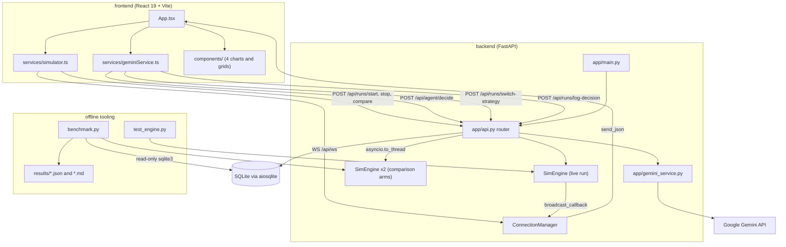
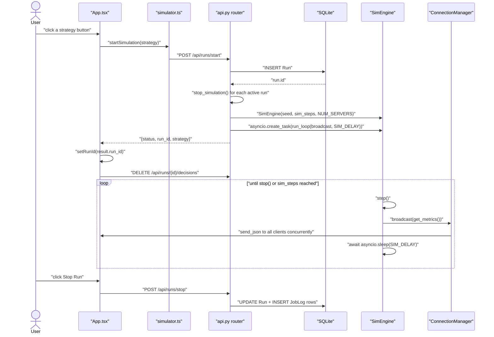
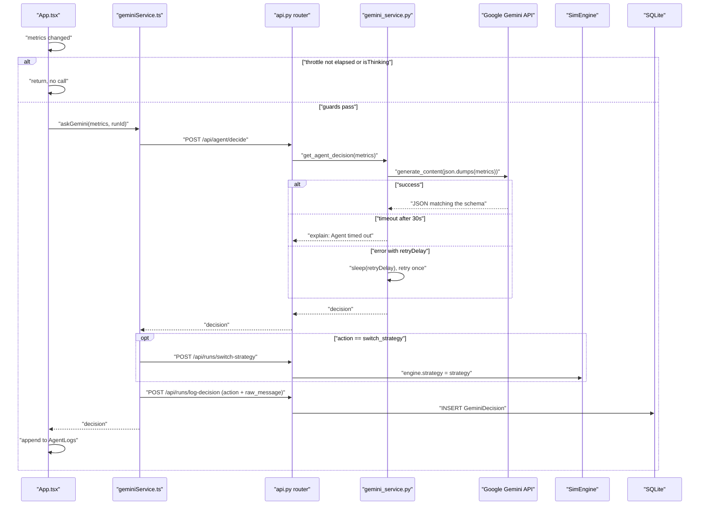
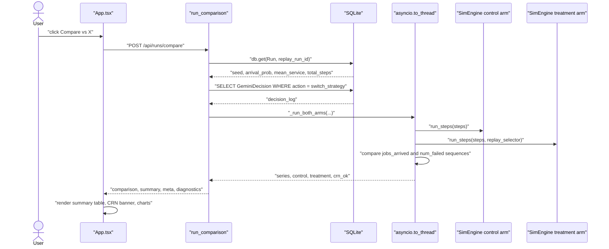
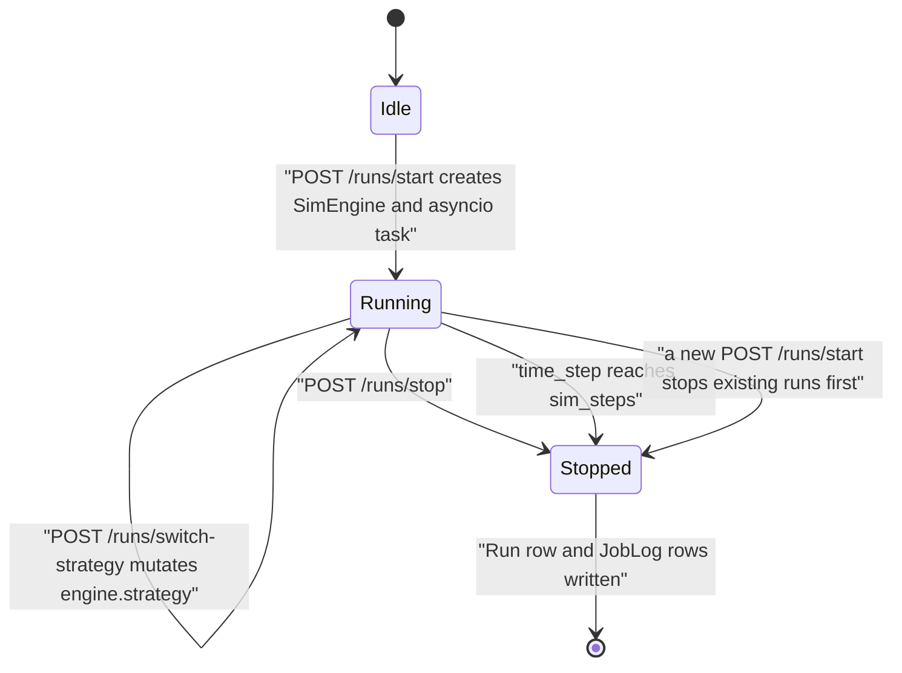
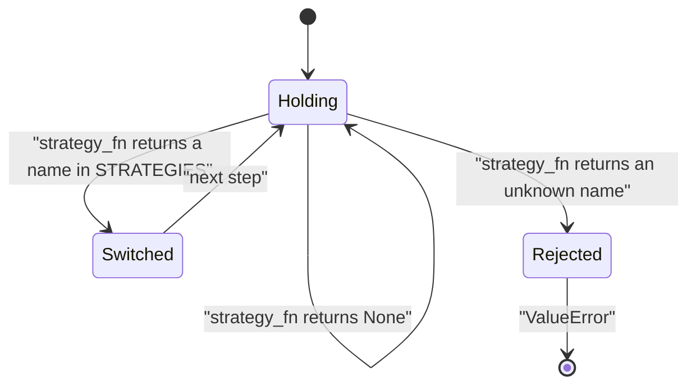
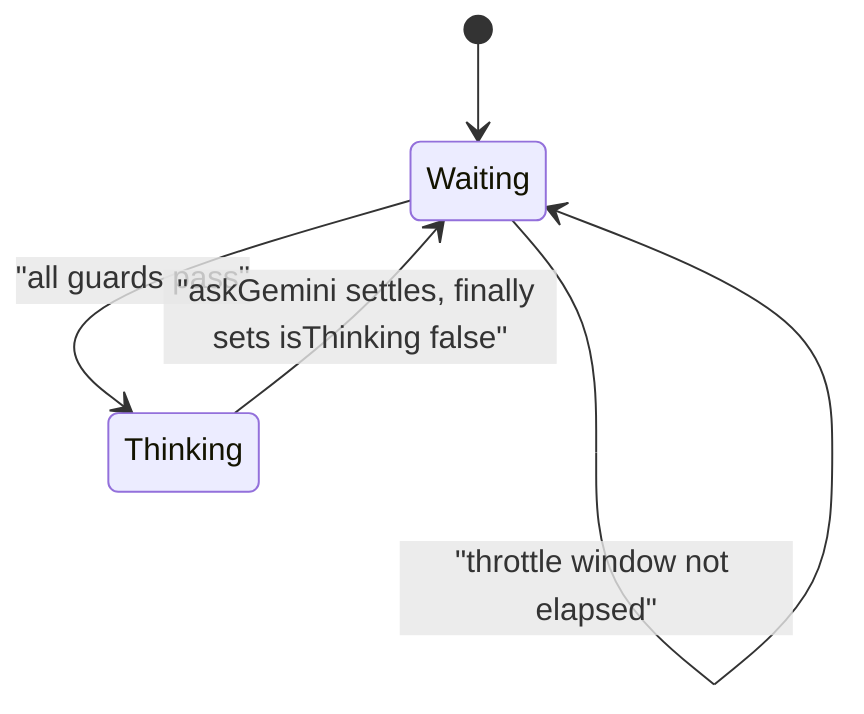

# SchedulerAI Orchestrator — Technical Deep Dive

> **Scope and method.** Everything below was derived by reading the source files in this
> repository. Every technical claim carries a citation of the form `path:Lstart-Lend`.
> Claims made by `README.md`, comments, and docstrings are treated as *assertions to be
> verified*, not as evidence — where they disagree with the code, that is recorded in
> [§14 Discrepancies](#14-discrepancies).
>
> Two runtime artifacts are cited. `results/benchmark_replay.json` and
> `results/benchmark_sweep.json` are committed outputs of `backend/benchmark.py` and are
> reproducible by re-running it. `backend/simulation.db` is a SQLite file present in the
> working tree but **not tracked by git** (`.gitignore:19` lists `*.db`); it is local
> developer state and is labelled as such wherever used.

---

## Table of Contents

1. [Overview](#1-overview)
2. [Repository Map](#2-repository-map)
3. [Tech Stack & Dependencies](#3-tech-stack--dependencies)
4. [System Architecture](#4-system-architecture)
5. [Entry Points & How It Runs](#5-entry-points--how-it-runs)
6. [Component Deep Dives](#6-component-deep-dives)
7. [Runtime Data Flow](#7-runtime-data-flow)
8. [HTTP / WebSocket Interface](#8-http--websocket-interface)
9. [LLM Integration Pipeline](#9-llm-integration-pipeline)
10. [Control Logic & State Machines](#10-control-logic--state-machines)
11. [Configuration Reference](#11-configuration-reference)
12. [Measured Results](#12-measured-results)
13. [Implementation Status](#13-implementation-status)
14. [Discrepancies](#14-discrepancies)
15. [Limitations Visible in Code](#15-limitations-visible-in-code)
16. [Needs Author Input](#16-needs-author-input)

---

## 1. Overview

This repository simulates a job scheduler over a fixed set of in-process "server" objects
and measures whether letting an LLM switch scheduling strategies at runtime beats holding
one strategy fixed. A single `SimEngine` advances the simulation one discrete step at a
time — injecting arrivals, executing one of five named assignment strategies, decrementing
work, and injecting random server failures (`backend/app/scheduler_engine.py:218-251`).
The same class backs both the live run and the offline comparison arms, so a measured
result is a statement about the code that actually ships
(`backend/app/scheduler_engine.py:81-88`).

During a live run the engine broadcasts a metrics snapshot over WebSocket after every step
(`backend/app/scheduler_engine.py:160-175`). The React dashboard consumes that stream and,
at most once per 15 000 ms, forwards the snapshot to `POST /api/agent/decide`
(`frontend/App.tsx:22`, `frontend/App.tsx:58-75`), which calls Gemini server-side with a
fixed system prompt and a constrained JSON schema
(`backend/app/gemini_service.py:191-212`). Each returned decision is applied to the running
engine and persisted with its reasoning text
(`frontend/services/geminiService.ts:44-74`, `backend/app/api.py:116-127`).

`POST /api/runs/compare` then re-simulates that run twice from the same seed — once on a
fixed strategy, once replaying the logged decisions at their exact recorded steps — and
returns both trajectories plus aggregate metrics (`backend/app/api.py:409-523`).
`backend/benchmark.py` does the same offline across many seeds and writes committed
reports to `results/` (`backend/benchmark.py:316-361`).

---

## 2. Repository Map

| Path | Role |
|---|---|
| `backend/app/scheduler_engine.py` | `Job`, `Server`, `SimEngine`, and **the only implementation of the five strategies** (`backend/app/scheduler_engine.py:1-448`) |
| `backend/app/api.py` | Routes, `ConnectionManager`, engine registries, and the comparison pipeline (`backend/app/api.py:1-523`) |
| `backend/app/gemini_service.py` | Lazy Gemini client, `SYSTEM_PROMPT`, response schema, timeout and retry (`backend/app/gemini_service.py:1-246`) |
| `backend/app/models.py` | Three SQLModel tables: `Run`, `JobLog`, `GeminiDecision` (`backend/app/models.py:5-34`) |
| `backend/app/database.py` | Async engine, `init_db()`, `get_session()` (`backend/app/database.py:10-21`) |
| `backend/app/config.py` | `Settings` — six settings, five from environment (`backend/app/config.py:4-25`) |
| `backend/app/main.py` | FastAPI app, CORS, lifespan, `GET /` (`backend/app/main.py:8-35`) |
| `backend/benchmark.py` | Measurement pipeline: `replay` and `sweep` modes, writes `results/` (`backend/benchmark.py:1-361`) |
| `backend/test_engine.py` | 18 invariant tests, dependency-free (`backend/test_engine.py:1-264`) |
| `backend/Dockerfile` | `python:3.11-slim`; `CMD uvicorn app.main:app` (`backend/Dockerfile:1-22`) |
| `backend/requirements.txt` | Ten pinned dependencies (`backend/requirements.txt:1-10`) |
| `backend/simulation.db` | SQLite, untracked (`.gitignore:19`). 43 `run` rows, 48 `geminidecision` rows |
| `results/BENCHMARK_replay.md`, `results/benchmark_replay.json` | Real logged decisions replayed vs each static strategy |
| `results/BENCHMARK_sweep.md`, `results/benchmark_sweep.json` | 30-seed rule-based sweep |
| `frontend/App.tsx` | WebSocket subscription, agent loop, run control, comparison summary table (`frontend/App.tsx:25-397`) |
| `frontend/types.ts` | Shared interfaces and the `STRATEGIES` list (`frontend/types.ts:1-115`) |
| `frontend/constants.ts` | `API_BASE_URL`, `WEBSOCKET_URL` (`frontend/constants.ts:1-7`) |
| `frontend/services/simulator.ts` | REST + WebSocket client (`frontend/services/simulator.ts:1-82`) |
| `frontend/services/geminiService.ts` | `askGemini` — proxy call, actuate, log (`frontend/services/geminiService.ts:1-81`) |
| `frontend/components/ServerGrid.tsx` | Cluster grid, three states (`frontend/components/ServerGrid.tsx:1-77`) |
| `frontend/components/MetricsCharts.tsx` | Live queue + per-server completion charts (`frontend/components/MetricsCharts.tsx:1-69`) |
| `frontend/components/AgentLogs.tsx` | Decision sidebar (`frontend/components/AgentLogs.tsx:1-63`) |
| `frontend/components/ComparisonCharts.tsx` | Three comparison charts (`frontend/components/ComparisonCharts.tsx:1-84`) |
| `render.yaml` | Two Render services (`render.yaml:1-36`) |
| `README.md` | Prose documentation; see [§14](#14-discrepancies) |

**Removed in the engine unification** (recoverable from git history): `calculate_metrics.py`,
a 410-line third copy of the simulation with hand-added strategy handicaps; and
`backend/start.sh`, an empty file.

---

## 3. Tech Stack & Dependencies

### Backend — `backend/requirements.txt:1-10`

| Package | Pinned |
|---|---|
| `fastapi` | 0.109.0 |
| `uvicorn[standard]` | 0.27.0 |
| `sqlmodel` | 0.0.14 |
| `aiosqlite` | 0.19.0 |
| `websockets` | 14.1 |
| `httpx` | 0.28.1 |
| `python-multipart` | 0.0.6 |
| `numpy` | 1.26.3 |
| `asyncio` | 3.4.3 |
| `google-genai` | 1.30.0 |

Base image `python:3.11-slim` (`backend/Dockerfile:1`).

`google-genai` is imported lazily inside `_load_sdk()`
(`backend/app/gemini_service.py:138-144`), so the simulation engine, the comparison
pipeline, and the test suite all run without it installed. `numpy` is used for exactly one
call, `np.std` in `fairness_std()` (`backend/app/scheduler_engine.py:400-402`).

### Frontend — `frontend/package.json:11-24`

| Package | Range |
|---|---|
| `react`, `react-dom` | ^19.2.0 |
| `recharts` | ^3.5.1 |
| `lucide-react` | ^0.555.0 |
| `vite` | ^6.2.0 |
| `@vitejs/plugin-react` | ^5.0.0 |
| `tailwindcss`, `@tailwindcss/vite` | ^4.0.0 |
| `typescript` | ~5.8.2 |
| `@types/node` | ^22.19.1 |

TypeScript targets `ES2022`, `jsx: "react-jsx"`, `noEmit: true`
(`frontend/tsconfig.json:3`, `frontend/tsconfig.json:21`, `frontend/tsconfig.json:28`).
There is no `@google/genai` entry — the SDK is backend-only.

---

## 4. System Architecture



**Reading the diagram.** `main.py` builds the `FastAPI` object and mounts the router under
`/api` (`backend/app/main.py:15-32`). Live simulation state lives in two module-level
dicts, `active_engines` and `active_tasks` (`backend/app/api.py:55-56`), so the engine and
the WebSocket manager share one process.

The comparison arms are the **same class** as the live engine — `_simulate()` constructs a
`SimEngine` with `record_history=True` and drives it synchronously
(`backend/app/api.py:326-339`). That call is wrapped in `asyncio.to_thread`
(`backend/app/api.py:479-482`) so a comparison does not block the event loop serving the
live run's broadcasts. `benchmark.py` constructs the identical engine
(`backend/benchmark.py:67-74`), which is why its numbers and the endpoint's agree.

---

## 5. Entry Points & How It Runs

### 5.1 Backend

`app` is created at `backend/app/main.py:15-19` with a `lifespan` whose startup half awaits
`init_db()` (`backend/app/main.py:8-13`), which runs `SQLModel.metadata.create_all`
(`backend/app/database.py:12-15`). Launched by the image as:

```
CMD ["uvicorn", "app.main:app", "--host", "0.0.0.0", "--port", "8000"]
```
(`backend/Dockerfile:22`)

### 5.2 Frontend

`frontend/index.html:40` loads `/index.tsx`, which mounts `<App />` into `#root` and throws
if that element is absent (`frontend/index.tsx:6-14`). Scripts are `dev`, `build`,
`preview` (`frontend/package.json:6-10`); the dev server binds port 3000 with
`strictPort: true` (`frontend/vite.config.ts:11-15`).

### 5.3 Measurement pipeline

`backend/benchmark.py` exposes two subcommands (`backend/benchmark.py:316-340`):

```
python benchmark.py sweep  --seeds 30 --steps 500
python benchmark.py replay --run-id 43
```
(`backend/benchmark.py:28-30`)

`replay` reads a decision log out of `simulation.db` over a read-only connection
(`backend/benchmark.py:157-174`) and replays it against each of the five static
strategies. `sweep` runs the rule-based selector across N seeds
(`backend/benchmark.py:207-228`). Both write a JSON dump and a Markdown report into
`results/` (`backend/benchmark.py:339-346`).

### 5.4 Tests

`python test_engine.py` from `backend/` runs 18 invariant tests with no third-party
dependencies (`backend/test_engine.py:229-240`). They are also pytest-discoverable.

### 5.5 Deployment

`render.yaml:3-19` defines `schedulerai-backend` as a Docker service health-checked at `/`,
with `GEMINI_API_KEY` marked `sync: false`. `render.yaml:22-36` defines the static
frontend with `VITE_API_BASE_URL` and `VITE_WEBSOCKET_URL`. The comment at
`render.yaml:15-19` notes the SQLite file sits on ephemeral storage and resets on redeploy.

---

## 6. Component Deep Dives

### 6.1 `Job` and `Server` — `backend/app/scheduler_engine.py:37-78`

`Job` carries `id`, `arrival_time`, `work_required`, `hash_id`, and `start_step`, and uses
`__slots__` (`backend/app/scheduler_engine.py:38-51`). `hash_id` is `int(job_id, 16)`
where `job_id` comes from the engine's seeded arrival stream
(`backend/app/scheduler_engine.py:214`), so a given seed always produces the same hash-ring
placement.

`Server` exposes an `available` property — `not busy and not failed`
(`backend/app/scheduler_engine.py:69-78`). Every strategy gates on it, which is what makes
failure injection actually bite.

### 6.2 `SimEngine` — `backend/app/scheduler_engine.py:81-448`

**Responsibility.** The whole simulation, for both the live run and the comparison arms.

**Constructor** (`backend/app/scheduler_engine.py:90-158`): `run_id`, `strategy`,
`arrival_prob`, `mean_service`, `seed`, `num_servers=8`, `sim_steps=0`,
`record_history=False`. An unknown strategy raises `ValueError`
(`backend/app/scheduler_engine.py:101-102`).

#### Three RNG streams

```python
self.rng_arrival = random.Random(seed * 1_000_003 + 1)
self.rng_failure = random.Random(seed * 1_000_003 + 2)
self.rng_strategy = random.Random(seed * 1_000_003 + 3)
```
(`backend/app/scheduler_engine.py:128-130`)

This is what makes Common Random Numbers hold. Arrivals draw only from `rng_arrival`
(`backend/app/scheduler_engine.py:228`, `backend/app/scheduler_engine.py:213-216`),
failures only from `rng_failure` (`backend/app/scheduler_engine.py:260-262`), and the only
strategy that consumes randomness — `random_backoff` — draws only from `rng_strategy`
(`backend/app/scheduler_engine.py:339-345`). Two engines built from the same seed therefore
see byte-identical arrival and failure sequences whatever strategies they run, which
`test_arrivals_and_failures_are_strategy_independent` asserts across all five
(`backend/test_engine.py:45-52`).

#### `run_loop` — `backend/app/scheduler_engine.py:160-175`

Steps, broadcasts, checks `sim_steps`, sleeps `tick_seconds`. The step budget is enforced
(`backend/app/scheduler_engine.py:170-174`), verified by
`test_sim_steps_is_enforced_by_run_loop` (`backend/test_engine.py:191-201`).

#### `run_steps` — `backend/app/scheduler_engine.py:180-200`

Synchronous driver for the comparison path. `strategy_fn(step, queue_len, fairness_std,
num_failed, queue_rate)` returns a strategy name or `None` to hold the current one, and the
return value is applied verbatim — any hysteresis belongs inside the callable
(`backend/app/scheduler_engine.py:187-200`).

#### `step()` — `backend/app/scheduler_engine.py:218-251`

1. `time_step += 1`, then `_process_failures()` (`:219-220`)
2. Queue-rate EMA with `EMA_ALPHA = 0.2` (`:222-224`, `backend/app/scheduler_engine.py:34`)
3. Arrival draw against `_current_arrival_prob()` (`:226-228`)
4. `_execute_strategy()` (`:230`)
5. Work decrement — **only for servers that are busy and not failed** (`:232-237`)
6. `max_queue_len` update and `_check_starvation()` (`:239-240`)
7. History append when `record_history` is set (`:243-251`)

#### Load curve — `backend/app/scheduler_engine.py:204-211`

Declared once as data (`backend/app/scheduler_engine.py:24-26`) and shared by every caller:

| `time_step` | base |
|---|---|
| `<= 80` | 0.3 |
| `81`–`180` | 0.95 |
| `181`–`300` | 0.6 |
| `301`–`400` | 0.4 |
| `> 400` | 0.85 |

Scaled by `arrival_prob / 0.6` and clamped to `[0, 1]`
(`backend/app/scheduler_engine.py:209-211`).

#### Failures — `backend/app/scheduler_engine.py:253-268`

Failed servers decrement `failure_duration` and recover at zero (`:255-258`); otherwise a
`FAILURE_PROB = 0.005` draw may fail them for `randint(10, 30)` steps
(`:259-261`, `backend/app/scheduler_engine.py:28-29`). A failure preempts the in-flight job
to the **front** of the queue, discarding progress (`:262-268`).

#### Starvation — `backend/app/scheduler_engine.py:296-309`

`starving` reflects the current state and is recomputed every step; `starvation_steps`
accumulates evidence (`:304-309`). The docstring states plainly that this is
starvation/livelock detection, not deadlock detection — there is no circular resource
dependency in this model (`:297-303`).

#### The five strategies

All five are here and nowhere else.

| Strategy | Lines | Behaviour |
|---|---|---|
| `baseline` | `:320-326` | Lowest `sid` first, one job each |
| `random_backoff` | `:328-348` | If more ready servers than jobs, one wins and losers back off `randint(2, 6)` steps |
| `consistent_hash` | `:350-367` | `hash_id % num_servers`, probing forward; queue rebuilt once |
| `token_ring` | `:369-374` | Holder is `(time_step // 2) % num_servers`; one claim |
| `leader_election` | `:376-398` | Leader re-elected every 20 steps, dispatches to workers then itself |

`_execute_strategy` dispatches through a dict rather than an `if/elif` chain
(`backend/app/scheduler_engine.py:311-318`), so an unknown strategy raises `KeyError`
instead of silently doing nothing.

Leader election uses `max(..., key=lambda s: (s.completed_count, -s.sid))`
(`backend/app/scheduler_engine.py:379-383`) — most completions wins, ties to the lowest
`sid`, deterministically.

#### Metrics — `backend/app/scheduler_engine.py:400-448`

`fairness_std()` (`:400-402`), `avg_wait()` — arrival to assignment, divided by
`jobs_assigned` so a preempted job contributes each time it waits (`:404-410`);
`avg_turnaround()` — arrival to completion (`:412-414`); `throughput()` (`:416-417`);
`avg_queue_len()` over recorded history (`:419-422`).

`get_metrics()` returns `{"run_id", "payload"}` where payload carries `time`, `queue_len`,
`queue_rate`, `num_failed`, `completed_total`, `deadlock_detected`, `strategy`,
`fairness_std`, `avg_wait`, and `servers[{sid, busy, completed, failed}]`
(`backend/app/scheduler_engine.py:424-448`).

#### Constants — `backend/app/scheduler_engine.py:24-34`

| Name | Value |
|---|---|
| `FAILURE_PROB` | 0.005 |
| `FAILURE_DURATION` | `(10, 30)` |
| `BACKOFF_DURATION` | `(2, 6)` |
| `LEADER_EPOCH_LEN` | 20 |
| `STARVATION_THRESHOLD` | 50 |
| `STARVATION_MIN_QUEUE` | 5 |
| `EMA_ALPHA` | 0.2 |
| `ARRIVAL_PROB_BASELINE` | 0.6 |

### 6.3 `ConnectionManager` — `backend/app/api.py:23-53`

`broadcast` returns immediately with no connections, then sends to all clients
concurrently via `asyncio.gather(..., return_exceptions=True)` and discards any that raised
(`backend/app/api.py:34-53`). There is no sleep in this method; pacing is the engine's job
(`backend/app/api.py:36-41`).

### 6.4 Routes — `backend/app/api.py`

| Route | Lines |
|---|---|
| `POST /runs/log-decision` | `:116-127` |
| `GET /runs/{run_id}/decisions` | `:130-139` |
| `DELETE /runs/{run_id}/decisions` | `:141-150` |
| `POST /runs/switch-strategy` | `:153-159` |
| `POST /agent/decide` | `:162-165` |
| `WS /ws` | `:168-175` |
| `POST /runs/start` | `:178-214` |
| `POST /runs/stop` | `:216-219` |
| `GET /runs` | `:257-262` |
| `POST /runs/compare` | `:401-491` |
| `GET /` | `backend/app/main.py:34-35` |

Strategy validation is centralised in `_validate_strategy`, which 400s on an unknown name
(`backend/app/api.py:109-112`).

`start_run` persists the config, stops any existing run, constructs the engine with
`settings.NUM_SERVERS` and the requested `sim_steps`, and launches `run_loop` with
`settings.SIM_DELAY` (`backend/app/api.py:178-214`, specifically `:204` and `:210`).

`stop_simulation` pops the engine first so a concurrent second call returns early
(`backend/app/api.py:222-255`). It writes `end_time`, `total_completed`, `total_steps`,
`deadlock_occurred` from `starvation_steps > 0`, and **`avg_wait_time`**
(`backend/app/api.py:241-245`), then persists every accumulated `JobLog`
(`backend/app/api.py:249-252`).

### 6.5 `gemini_service` — `backend/app/gemini_service.py`

`GEMINI_MODEL = "gemini-3.6-flash"` (`:12`). `REQUEST_TIMEOUT_SECONDS = 30.0` (`:16`).

The SDK import is deferred into `_load_sdk()` (`:138-144`) and the client plus response
schema are built once on first use (`:147-176`). `_parse_retry_delay` matches fractional
seconds via `([0-9]*\.?[0-9]+)s` (`:179-184`).

`_call_gemini_once` wraps the blocking call in `asyncio.to_thread` inside
`asyncio.wait_for` (`:193-203`), sends `json.dumps(metrics)` rather than `str(metrics)`
(`:199`), and rejects a `switch_strategy` response naming a strategy outside
`STRATEGIES` (`:209-210`).

`get_agent_decision` handles timeout separately from other failures, retries once only when
a `retryDelay` was parseable, and otherwise degrades via `_fallback` (`:187-201`), which
stamps `degraded: True` on the response. That flag is what lets a caller tell "the agent
looked and chose to hold" apart from "the agent was never reachable" — both arrive as
`action: "explain"`.

### 6.6 Comparison pipeline — `backend/app/api.py:274-523`

**`gemini_strategy_selector`** (`:274-289`) is the rule-based selector. Its docstring states
that it is not Gemini and that results built from it are flagged via `meta.treatment_mode`.
It is reachable **only** when the caller explicitly asks for `treatment: "heuristic"`
(`backend/app/api.py:463-465`); it is never substituted automatically.

| Order | Condition | Returns |
|---|---|---|
| 1 | `num_failed >= 2` | `consistent_hash` |
| 2 | `queue_rate > 3` | `leader_election` |
| 3 | `fairness_std > 5 and queue_len < 20` | `token_ring` |
| 4 | `queue_len > 30` | `random_backoff` |
| — | fallback | `baseline` |

**`build_replay_selector`** (`:292-309`) maps step to strategy and returns
`by_step.get(step)` (`:307`) — a hit switches, a miss returns `None`, which `run_steps`
treats as "hold". No hysteresis is applied to replayed decisions. Verified by
`test_replay_applies_decisions_at_exact_steps`, which uses decisions 8 and 9 steps apart
(`backend/test_engine.py:105-124`).

**`build_heuristic_selector`** (`:312-323`) owns its own `min_hold = 15` gate (`:318`), so
hysteresis applies to the heuristic only.

**`summarise`** (`:341-358`) returns eleven aggregate metrics per arm.

**`_run_both_arms`** (`:360-407`) builds the control and treatment engines from the same
seed, zips their histories into the three chart series, counts divergent steps, and
computes a CRN self-check comparing `jobs_arrived` and the per-step `num_failed` sequence
(`:393-397`). A `strategy_fn` of `None` means the treatment arm holds `base_strategy`, so
both arms are identical and every delta is zero.

**`run_comparison`** (`:409-523`) resolves config from the DB when `replay_run_id` is given
(`:427-452`), loads **every** logged decision — not only switches — so the count can
distinguish an agent that held from an agent that was never consulted (`:441-451`), then
selects one of four treatment modes (`:463-474`):

| `treatment_mode` | When | Treatment arm |
|---|---|---|
| `heuristic` | caller passed `treatment: "heuristic"` | `build_heuristic_selector` — the rule table, not the model |
| `replay` | the run has logged `switch_strategy` decisions | `build_replay_selector` over those switches |
| `agent_held` | decisions exist but none are switches | `None` — arms identical, all deltas zero |
| `no_agent_data` | the run has no decisions at all | `None` — arms identical, nothing to compare |

It then offloads both arms to a thread (`:479-482`) and returns `comparison`, `summary`
(with `control`, `treatment`, `delta_pct`), `meta` (including `treatment_mode`,
`decisions_logged` and `crn_verified`), and `diagnostics` (`:488-523`).

Before this split, any run without replayable switches silently fell through to the rule
table, producing a full result table whose "Agent" column no agent had contributed to.
`test_no_strategy_fn_makes_the_arms_identical` (`backend/test_engine.py:136-149`) pins the
null-result behaviour.

### 6.7 `benchmark.py` — `backend/benchmark.py:1-361`

`compare()` (`:104-155`) runs paired arms per seed, accumulates per-metric deltas, and
records any seed where `crn_holds()` (`:76-83`) fails. `paired_stats()` (`:85-102`) computes
mean, sample std, and a 95% confidence interval from an embedded two-sided t table
(`:51-58`), falling back to 1.96 above df 30. `LOWER_IS_BETTER` (`:60-61`) drives the
direction of "better" per metric.

`render_markdown` (`:230-314`) labels every report with its treatment source and prints the
CRN verdict.

### 6.8 Frontend

**`askGemini`** (`frontend/services/geminiService.ts:17-80`) POSTs to `/api/agent/decide`
(`:23-29`), returns a fixed `OFFLINE` decision on any throw (`:4-9`, `:30-33`), actuates a
`switch_strategy` (`:41-50`), and logs every **real** decision including `explain` holds,
with `action` and `raw_message` carried through (`:62-72`). Degraded responses are dropped
before logging (`:60`) — they are the proxy reporting that it never reached the model, and
writing them to the decision log made a run with zero model contact look like a run where
the agent deliberately held.

**`App.tsx`** (`frontend/App.tsx:25-300`). The WebSocket effect drops frames unless
`isRunningRef.current` is set (`:46`) and trims history to `HISTORY_LIMIT = 50`
(`:49-52`, `:23`). The agent effect is gated on `isThinking` and the 15 000 ms throttle and
resets `isThinking` in a `finally` (`:58-75`). `handleStart` sets `runId` from the start
response (`:91`) rather than waiting for the first WebSocket frame. Start buttons are
disabled while a run is active (`:198`). A red banner appears when
`meta.crn_verified` is false (`:262-267`).

**`ComparisonSummary`** (`frontend/App.tsx:347-397`) renders the single authoritative
aggregate table, colouring by whether lower or higher is better per row.

**`ServerGrid`** (`frontend/components/ServerGrid.tsx:14-77`) renders three states —
failed, busy, idle — via `styleFor` (`:14-37`) and shows an offline count in the header
(`:40`, `:47-51`).

**`ComparisonCharts`** (`frontend/components/ComparisonCharts.tsx:38-84`) plots the full
series rather than a trailing window, through one reusable `ComparisonChart` component
(`:38-65`).

---

## 7. Runtime Data Flow

### 7.1 Live run



Sources: `frontend/App.tsx:77-104`, `backend/app/api.py:178-214`,
`backend/app/scheduler_engine.py:160-175`, `backend/app/api.py:34-53`,
`backend/app/api.py:222-255`.

### 7.2 Agent decision cycle



Sources: `frontend/App.tsx:58-75`, `frontend/services/geminiService.ts:17-79`,
`backend/app/gemini_service.py:191-233`, `backend/app/api.py:153-165`,
`backend/app/api.py:116-127`.

### 7.3 Comparison



Sources: `frontend/App.tsx:120-133`, `backend/app/api.py:409-523`,
`backend/app/api.py:360-407`.

---

## 8. HTTP / WebSocket Interface

No ROS packages, launch files, message definitions, URDF/Xacro files, or TF frames exist in
this repository.

### 8.1 Endpoints

| Method | Path | Request | Returns | Source |
|---|---|---|---|---|
| `GET` | `/` | — | `{"message": ...}` | `backend/app/main.py:34-35` |
| `WS` | `/api/ws` | — | Server-pushed `{run_id, payload}` | `backend/app/api.py:168-175` |
| `POST` | `/api/runs/start` | `StartRunRequest` | `{status, run_id, strategy}` | `backend/app/api.py:178-214` |
| `POST` | `/api/runs/stop` | `StopRunRequest` | `{status, run_id}` | `backend/app/api.py:216-219` |
| `GET` | `/api/runs` | `skip`, `limit` | `list[Run]` | `backend/app/api.py:257-262` |
| `POST` | `/api/runs/switch-strategy` | `SwitchStrategyRequest` | `{status, strategy}` | `backend/app/api.py:153-159` |
| `POST` | `/api/runs/compare` | `ComparisonRequest` | `{comparison, summary, meta, diagnostics}` | `backend/app/api.py:409-523` |
| `POST` | `/api/runs/log-decision` | `LogDecisionRequest` | `{status: "logged"}` | `backend/app/api.py:116-127` |
| `GET` | `/api/runs/{run_id}/decisions` | path param | `list[GeminiDecision]` | `backend/app/api.py:130-139` |
| `DELETE` | `/api/runs/{run_id}/decisions` | path param | `{status: "cleared"}` | `backend/app/api.py:141-150` |
| `POST` | `/api/agent/decide` | `AgentDecideRequest` | decision dict | `backend/app/api.py:162-165` |

`DELETE /api/runs/clear-all` was removed. It dropped all three tables with no
authentication and nothing in the UI called it.

CORS is global with `allow_credentials=False` (`backend/app/main.py:21-30`).

### 8.2 Request model defaults

| Model | Defaults | Source |
|---|---|---|
| `StartRunRequest` | `sim_steps=2000`, `arrival_prob=0.6`, `mean_service=8.0`, `seed=1` | `backend/app/api.py:61-66` |
| `ComparisonRequest` | `base_strategy="baseline"`, `treatment="replay"`, `steps=200`, `arrival_prob=0.6`, `mean_service=8.0`, `seed=1` | `backend/app/api.py:98-116` |
| `LogDecisionRequest` | `strategy=None`, `action="switch_strategy"`, `raw_message=""` | `backend/app/api.py:73-78` |

The frontend passes all four start parameters explicitly
(`frontend/services/simulator.ts:14-20`), so backend defaults apply only to direct API
callers.

### 8.3 Database schema — `backend/app/models.py:5-34`

| Table | Columns |
|---|---|
| `Run` | `id`, `strategy`, `seed`, `arrival_prob`, `mean_service`, `sim_steps`, `start_time`, `end_time`, `total_completed`, `total_steps`, `deadlock_occurred`, `avg_wait_time` (`:5-17`) |
| `JobLog` | `id`, `run_id` (FK), `job_internal_id`, `arrival_step`, `completion_step`, `processed_by` (`:19-25`) |
| `GeminiDecision` | `id`, `run_id` (FK), `step`, `strategy`, `action`, `raw_message`, `timestamp` (`:27-34`) |

The schema is unchanged from before the refactor; `JobLog` and `avg_wait_time` were always
declared, and are now written.

### 8.4 Loop rates

| Loop | Period | Source |
|---|---|---|
| `SimEngine.run_loop` | `settings.SIM_DELAY`, default 0.5 s | `backend/app/scheduler_engine.py:175`, `backend/app/config.py:16` |
| Frontend agent throttle | 15 000 ms | `frontend/App.tsx:22` |
| Gemini request timeout | 30 s | `backend/app/gemini_service.py:16` |

---

## 9. LLM Integration Pipeline

There is no machine-learning model, no computer-vision pipeline, and no model weights in
this repository. The only inference is a remote call to a hosted Gemini model.

**Model.** `GEMINI_MODEL = "gemini-3.6-flash"`, a module constant not configurable by
environment (`backend/app/gemini_service.py:12`).

**Credential.** `settings.GEMINI_API_KEY`, default `""` (`backend/app/config.py:25`),
marked `sync: false` in `render.yaml:11-12`. `_get_client_and_config` raises if it is empty
(`backend/app/gemini_service.py:150-151`).

**Prompt.** A 115-line `SYSTEM_PROMPT` (`backend/app/gemini_service.py:18-132`) covering
per-strategy tradeoffs (`:24-58`), the nine metric fields supplied (`:64-74`), a six-step
reasoning procedure (`:78-112`) whose step 5 asks for a 20–30 step hysteresis with an
exception at `num_failed >= 3` (`:98-101`), and the response format (`:116-132`). The
`num_failed` description now states that a failed server accepts no work and makes no
progress (`:67-69`), which matches the engine.

**Input.** `json.dumps(metrics)` (`backend/app/gemini_service.py:199`).

**Output constraint.** `response_mime_type="application/json"` plus a `types.Schema` with
`action` enum-constrained to `["switch_strategy", "explain"]`, `strategy` nullable and
enum-constrained to `STRATEGIES`, and `required=["action", "message"]`
(`backend/app/gemini_service.py:153-175`).

**Postprocessing.** `json.loads(response.text)` (`:207`), then a strategy-name check that
raises on a hallucinated value (`:209-210`). A rejected response falls into the retry path.

**Thresholds.** The 15 000 ms client throttle (`frontend/App.tsx:22`), the `isThinking`
in-flight guard (`frontend/App.tsx:59`), and the 30 s request timeout
(`backend/app/gemini_service.py:16`). No temperature, top-k, top-p, or token limit is set.

---

## 10. Control Logic & State Machines

### 10.1 Run lifecycle



Sources: `backend/app/api.py:199-212`, `backend/app/scheduler_engine.py:163-175`,
`backend/app/api.py:158`, `backend/app/api.py:222-255`,
`backend/app/scheduler_engine.py:170-174`.

The `sim_steps` transition is new; previously a run only ended by manual stop.

### 10.2 Strategy selection in `run_steps`



Source: `backend/app/scheduler_engine.py:187-200`. The gate that used to sit here moved
into `build_heuristic_selector` (`backend/app/api.py:312-323`), so it applies to the
heuristic only and never to replayed decisions.

### 10.3 Agent loop



Source: `frontend/App.tsx:58-75`. `askGemini` never rejects — it catches internally and
returns `OFFLINE` (`frontend/services/geminiService.ts:30-33`) — and `isThinking` is
cleared in a `finally` (`frontend/App.tsx:68-70`), so the loop cannot wedge.

---

## 11. Configuration Reference

### 11.1 `backend/app/config.py:4-25`

| Setting | Env var | Default | Read by |
|---|---|---|---|
| `PROJECT_NAME` | — | `"SchedulerAI Backend"` | `backend/app/main.py:16` |
| `DATABASE_URL` | `DATABASE_URL` | `sqlite+aiosqlite:///./simulation.db` | `backend/app/database.py:10` |
| `NUM_SERVERS` | `NUM_SERVERS` | `8` | `backend/app/api.py:204`, `backend/app/api.py:326` |
| `SIM_DELAY` | `SIM_DELAY` | `0.5` | `backend/app/api.py:210` |
| `CORS_ORIGINS` | `CORS_ORIGINS` | `["*"]` | `backend/app/main.py:23` |
| `GEMINI_API_KEY` | `GEMINI_API_KEY` | `""` | `backend/app/gemini_service.py:149-152` |

All six are now read. `NUM_SERVERS` and `SIM_DELAY` were previously declared and ignored.

### 11.2 `frontend/constants.ts:1-2`

| Constant | Env var | Fallback |
|---|---|---|
| `API_BASE_URL` | `VITE_API_BASE_URL` | `http://localhost:8000` |
| `WEBSOCKET_URL` | `VITE_WEBSOCKET_URL` | `ws://localhost:8000/api/ws` |

The duplicate `SYSTEM_PROMPT` that used to live here was removed; a comment points at the
single remaining copy (`frontend/constants.ts:4-7`).

### 11.3 Other files

| File | Controls |
|---|---|
| `backend/Dockerfile:18-19` | `ENV PORT=8000`; `ENV DATABASE_URL` |
| `render.yaml:10-19` | Backend env: `GEMINI_API_KEY`, `CORS_ORIGINS` |
| `render.yaml:28-36` | Frontend env and SPA rewrite |
| `frontend/vite.config.ts:11-21` | Port 3000, `strictPort`, React + Tailwind, `@` alias |
| `frontend/tsconfig.json:2-29` | ES2022, `react-jsx`, `noEmit` |
| `.gitignore:1-30` | `node_modules`, `dist`, `venv/`, `__pycache__/`, `*.pyc`, `*.db` |

---

## 12. Measured Results

These come from `backend/benchmark.py` and are committed. Both modes report
`crn_verified: true` for every comparison — the two arms saw identical arrivals and
failures in every pair (`results/benchmark_replay.json`, `results/benchmark_sweep.json`).

### 12.1 Real logged decisions — `results/BENCHMARK_replay.md`

Run 43's 14 logged decisions replayed at their exact steps, seed 1, 202 steps,
`arrival_prob=0.6`, `mean_service=8.0` (`results/benchmark_replay.json`). Negative is
better for queue and wait; positive is better for throughput; negative is better for
fairness std.

| vs static | avg queue | avg wait | throughput | avg fairness std |
|---|---|---|---|---|
| `baseline` | +30.4% | +30.9% | −4.2% | −19.8% |
| `random_backoff` | +15.4% | +15.7% | −0.9% | +27.6% |
| `consistent_hash` | +11.7% | +12.0% | +0.9% | +6.6% |
| `token_ring` | **−66.1%** | **−58.9%** | **+54.8%** | +114.5% |
| `leader_election` | +19.3% | +16.8% | −1.7% | −11.2% |

The agent arm loses on queue and throughput against four of the five static strategies and
wins decisively against exactly one, `token_ring`.

This is a single seed. A decision log is tied to the run that produced it, so it cannot be
replicated across seeds (`backend/benchmark.py:176-205`).

### 12.2 Rule-based sweep, 30 seeds — `results/BENCHMARK_sweep.md`

The treatment arm here is `gemini_strategy_selector`, **not** the LLM
(`backend/app/api.py:274-289`). 30 seeds, 500 steps
(`results/benchmark_sweep.json`).

| vs static | avg queue | avg wait | throughput | 95% CI of paired queue delta |
|---|---|---|---|---|
| `baseline` | +292.7% | +259.7% | −4.8% | [3.40, 4.97] |
| `random_backoff` | +181.3% | +159.8% | −4.5% | [2.57, 4.08] |
| `consistent_hash` | +268.0% | +236.9% | −4.5% | [3.02, 4.76] |
| `token_ring` | **−88.0%** | **−89.0%** | **+33.8%** | [−42.18, −38.15] |
| `leader_election` | +290.5% | +253.5% | −4.9% | [3.30, 5.16] |

Every interval excludes zero, so each effect is consistent across seeds rather than
seed-to-seed noise (`backend/benchmark.py:85-102`). The direction matches §12.1: dynamic
switching helps only against `token_ring`.

### 12.3 Test suite

18 invariant tests pass (`backend/test_engine.py:1-264`), covering CRN
(`:45-79`), failure semantics (`:81-103`), replay fidelity (`:105-172`), strategy behaviour
(`:174-213`), and bookkeeping (`:215-262`).

---

## 13. Implementation Status

| Feature | Status | Citation |
|---|---|---|
| FastAPI app, CORS, lifespan `init_db` | [IMPLEMENTED] | `backend/app/main.py:8-35` |
| `SimEngine` live loop with `sim_steps` enforcement | [IMPLEMENTED] | `backend/app/scheduler_engine.py:160-175` |
| Five strategies, single implementation | [IMPLEMENTED] | `backend/app/scheduler_engine.py:320-398` |
| Failure-aware assignment in all five | [IMPLEMENTED] | `backend/app/scheduler_engine.py:69-78` |
| Failed servers make no progress | [IMPLEMENTED] | `backend/app/scheduler_engine.py:235` |
| Three-stream CRN | [IMPLEMENTED] | `backend/app/scheduler_engine.py:128-130` |
| Reproducible job identity | [IMPLEMENTED] | `backend/app/scheduler_engine.py:213-216` |
| Non-latching starvation flag | [IMPLEMENTED] | `backend/app/scheduler_engine.py:296-309` |
| Concurrent WebSocket broadcast | [IMPLEMENTED] | `backend/app/api.py:34-53` |
| Server-side Gemini proxy, lazy SDK | [IMPLEMENTED] | `backend/app/gemini_service.py:138-144` |
| Request timeout and fractional retry parsing | [IMPLEMENTED] | `backend/app/gemini_service.py:179-184`, `:191-203` |
| Hallucinated-strategy rejection | [IMPLEMENTED] | `backend/app/gemini_service.py:209-210` |
| Decision logging with `action` and `raw_message` | [IMPLEMENTED] | `frontend/services/geminiService.ts:61-72` |
| `avg_wait_time` and `JobLog` persistence | [IMPLEMENTED] | `backend/app/api.py:245`, `:249-252` |
| Replay at exact logged steps | [IMPLEMENTED] | `backend/app/api.py:292-309` |
| Heuristic hysteresis, scoped to the heuristic | [IMPLEMENTED] | `backend/app/api.py:312-323` |
| Rule table opt-in only, never a silent fallback | [IMPLEMENTED] | `backend/app/api.py:463-474` |
| Four distinct treatment modes reported | [IMPLEMENTED] | `backend/app/api.py:463-474`, `frontend/App.tsx:319-345` |
| Degraded responses excluded from the decision log | [IMPLEMENTED] | `backend/app/gemini_service.py:187-201`, `frontend/services/geminiService.ts:60` |
| Comparison offloaded off the event loop | [IMPLEMENTED] | `backend/app/api.py:479-482` |
| Runtime CRN self-check surfaced to the UI | [IMPLEMENTED] | `backend/app/api.py:393-397`, `frontend/App.tsx:262-267` |
| Benchmark pipeline with paired CIs | [IMPLEMENTED] | `backend/benchmark.py:85-155` |
| Committed results | [IMPLEMENTED] | `results/BENCHMARK_replay.md`, `results/BENCHMARK_sweep.md` |
| Invariant test suite | [IMPLEMENTED] | `backend/test_engine.py:1-264` |
| `runId` set from start response | [IMPLEMENTED] | `frontend/App.tsx:91` |
| Failed-server rendering | [IMPLEMENTED] | `frontend/components/ServerGrid.tsx:14-37` |
| Start buttons disabled while running | [IMPLEMENTED] | `frontend/App.tsx:198` |
| `DELETE /api/runs/clear-all` | **Removed** | absent from `backend/app/api.py` |
| `calculate_metrics.py` | **Removed** | absent from the tree |
| Authentication on any route | **Not implemented** | no auth dependency anywhere in `backend/app/api.py` |
| `SQLModel.metadata.drop_all` reset | [COMMENTED OUT] | `backend/app/database.py:14` |
| `LICENSE` file | **Not present** | `README.md:10` and `README.md:599` reference it |

---

## 14. Discrepancies

Documented claims the code contradicts.

**1. README results table is wrong.** `README.md:58-63` reports avg queue 1.6 vs 13.8 and
128 vs 91 jobs completed, a −88% queue reduction and +41% throughput attributed to a
comparison against static `random_backoff`. The measured figure against `random_backoff` is
**+15.4% queue and −0.9% throughput** — the agent arm is worse
(`results/benchmark_replay.json`). The −88% figure corresponds to the comparison against
**`token_ring`**, not `random_backoff` (`results/benchmark_sweep.json`).

The original numbers came from a comparison engine whose `random_backoff` had no backoff
mechanism and whose `leader_election` was behaviourally identical to `baseline`. That engine
no longer exists.

**2. README fairness table is unverified.** `README.md:80-86` gives five AI-vs-static
fairness pairs. Measured fairness std moves in both directions depending on the baseline —
better against `baseline` and `leader_election`, worse against `random_backoff`,
`consistent_hash` and `token_ring` (`results/benchmark_replay.json`). No committed output
matches the README's numbers.

**3. Gemini model version.** `README.md:9`, `README.md:34` and `frontend/metadata.json:3`
say Gemini 2.5 Flash. The code sets `GEMINI_MODEL = "gemini-3.6-flash"`
(`backend/app/gemini_service.py:12`).

**4. Gemini in the browser.** `README.md:118-119` and `README.md:533-536` describe metrics
going from the WebSocket client straight to the Gemini API with the key bundled
client-side. The browser only POSTs to `/api/agent/decide`
(`frontend/services/geminiService.ts:26-30`); the SDK call is server-side
(`backend/app/gemini_service.py:191-203`); `@google/genai` is not in
`frontend/package.json:11-16`.

**5. Broadcast interval.** `README.md:116` and `README.md:360` say 0.5 s, and the old
observed rate was 1.5 s/step. The tick is now `settings.SIM_DELAY`, default 0.5 s
(`backend/app/scheduler_engine.py:175`, `backend/app/config.py:16`) — so the README figure
is now correct, but for a different reason than it states.

**6. Load-profile third phase.** `README.md:233` says steps 181–202 run at 0.85. For
`time_step <= 300` the base is 0.6 (`backend/app/scheduler_engine.py:24`); 0.85 applies only
above step 400 (`backend/app/scheduler_engine.py:25`).

**7. `token_ring` "perfect fairness".** `README.md:155` and the prompt at
`backend/app/gemini_service.py:43` claim it. The holder is skipped when unavailable with no
compensation (`backend/app/scheduler_engine.py:369-374`), so a server busy on a long job
forfeits its turns. It is measurably the *fairest* of the five
(`backend/test_engine.py:158-169`), but not perfectly fair.

**8. Project structure.** `README.md:485-496` places frontend sources under `frontend/src/`.
They are at the `frontend/` root.

**9. LICENSE.** `README.md:10` and `README.md:599` advertise an MIT LICENSE file. No such
file exists.

**10. README "What I Would Do Next" is partly done.** `README.md:544-548` proposes moving
Gemini to the backend (already done before this refactor) and `README.md:549-552` proposes
multi-seed statistical validation, which `backend/benchmark.py:207-228` now implements.

---

## 15. Limitations Visible in Code

**Security**

1. No authentication on any route. `POST /api/runs/start` and `POST /api/runs/compare` are
   publicly reachable on the deployed service (`render.yaml:3-8`) and both are compute-bound.
2. `CORS_ORIGINS` defaults to `["*"]` (`backend/app/config.py:20-24`). `render.yaml:13-14`
   overrides it in production, but CORS is browser-enforced and does not restrict direct
   HTTP clients.

**Scale and deployment**

3. Module-level `active_engines` / `active_tasks` (`backend/app/api.py:55-56`) confine the
   backend to a single process; multiple uvicorn workers would not share run state.
4. Broadcasts go to every connected socket regardless of run; filtering is left to the
   client (`backend/app/api.py:42-53`, `frontend/App.tsx:46`).
5. `render.yaml:15-19` documents that the SQLite file sits on ephemeral storage and resets
   on redeploy, so `simulation.db` and every logged decision are lost on each deploy.
6. `asyncio==3.4.3` (`backend/requirements.txt:9`) is an obsolete PyPI backport of a stdlib
   module. `numpy` (`:8`) is pulled in for a single `np.std` call
   (`backend/app/scheduler_engine.py:400-402`) and forces `build-essential` into the image
   (`backend/Dockerfile:6-8`).

**Method**

7. §12.1 is a single seed. The replay result cannot be given a confidence interval because
   a decision log belongs to one run (`backend/benchmark.py:187-191`).
8. §12.2 measures a rule table, not the LLM (`backend/app/api.py:274-289`). Nothing in the
   repository compares Gemini against that rule table under matched conditions, which is
   the question of whether the model adds value over an `if/elif` chain.
9. The load curve is one fixed shape (`backend/app/scheduler_engine.py:24-26`). No bursty,
   ramp, or oscillating profile is implemented.
10. `avg_wait` counts each assignment, so a job preempted by failure and requeued
    contributes more than once (`backend/app/scheduler_engine.py:404-410`). This is stated
    in the docstring but makes the metric not a pure per-job wait.

**Concurrency**

11. `start_run` stops existing runs (`backend/app/api.py:195-196`) with no lock, leaving a
    window in which two near-simultaneous requests both pass the loop.
12. A Gemini call that exceeds the 30 s timeout unblocks the caller but the worker thread
    persists until the underlying HTTP request settles
    (`backend/app/gemini_service.py:191-203`).

**Data**

13. `Run.sim_steps` records the requested budget, not necessarily the steps run; a manual
    stop leaves `total_steps < sim_steps` (`backend/app/api.py:243`).
14. Historical rows predating the fixes still carry `avg_wait_time = 0.0`, empty
    `raw_message`, and no `JobLog` rows. Those decisions' reasoning is unrecoverable.

**Housekeeping**

15. No TODO or FIXME comment appears in any first-party source file.
16. `docs/PROJECT_DEEP_DIVE.md` (this file) must be regenerated whenever the engine changes;
    nothing enforces that.

---

## 16. Needs Author Input

**Results and framing**

1. `README.md:58-63` and `README.md:80-86` are contradicted by §12. Should the README be
   rewritten around the measured numbers, and is the honest framing — "dynamic switching
   rescues a badly matched fixed strategy and costs a few percent against a well-matched
   one" — the claim you want to make?
2. Run 43's decision log is the only real agent trace in the repository and lives in an
   untracked, ephemeral SQLite file. Should it be exported and committed?
3. Do you want the Gemini-vs-rule-table ablation (§15.8)? It is the sharpest remaining
   question and the pipeline now supports it.

**Design intent**

4. Is `gemini-3.6-flash` the model you intend to ship
   (`backend/app/gemini_service.py:12`)?
5. `SIM_DELAY` now defaults to 0.5 s, making runs three times faster than the previous
   observed 1.5 s/step. Is that the pacing you want for a live demo?
6. Should `sim_steps` remain enforced, or do you want indefinite runs available?
7. The prompt asks the model for 20–30 step hysteresis (`backend/app/gemini_service.py:98`)
   but nothing enforces it server-side. Should a minimum hold be applied to live switches?

**Environment**

8. What hardware and Gemini tier were in effect for run 43, and was it local or on Render?
9. Should the MIT LICENSE referenced at `README.md:10` be added?
10. `interview_prep_guide.md` was deleted from the working tree but remains in git history.
    Restore, or leave removed?
